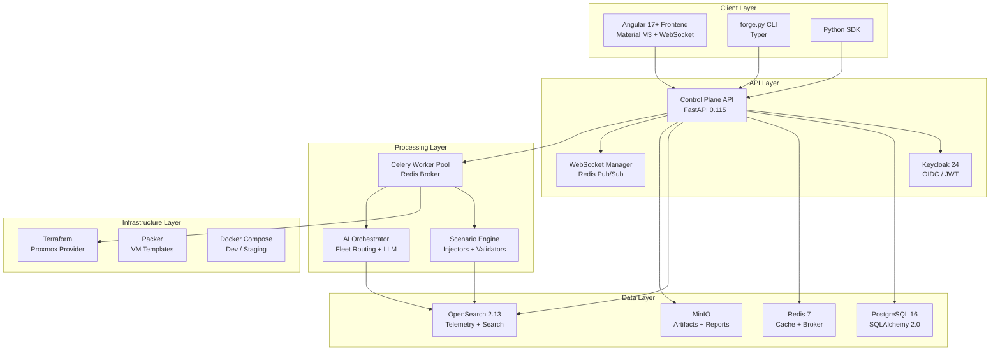

# TrueNorth Range

 

> **Test status:** 461 passed, 27 skipped (`.venv/bin/python -m pytest -q`).
> The 27 skips are integration tests requiring external services and are skipped
> by design. Previous CI-passing and 87%-coverage badges were static images with
> no pipeline or coverage artifact behind them, so they have been removed rather
> than left to imply a guarantee that does not exist.

**AI-enhanced cyber training platform for building, running, and evaluating incident response exercises on isolated virtual environments.**

TrueNorth Range empowers cybersecurity teams to conduct realistic training at scale — from single-team tabletop exercises to enterprise-wide drills spanning **1,200+ concurrent users** and **70,000+ VMs**. The platform combines automated range provisioning, scenario-driven attack simulation, real-time telemetry collection, AI-assisted analysis, and comprehensive after-action review into a single integrated system.

---

## Product Vision

Modern security operations demand continuous, realistic training. TrueNorth Range provides:

- **Scenario-driven exercises** — YAML-defined attack timelines executed by a pluggable injector framework simulating APT campaigns, insider threats, ransomware, and supply-chain compromises.
- **Isolated virtual ranges** — Each range is a network-segmented environment provisioned via Terraform/Proxmox with full VLAN isolation, firewall rules, and sensor deployment.
- **AI-enhanced analysis** — Integrated AI Orchestrator generates detection rules, suggests scenario variations, and produces automated after-action reports using configurable LLM backends (OpenAI, Anthropic, Ollama, or mock).
- **Scoring and AAR** — Objective-based scoring with automated validation (OpenSearch queries, deliverable checks, manual acknowledgments) and exportable After Action Reports (HTML/PDF).
- **xAPI/cmi5 interoperability** — Every training event emits xAPI statements for LRS integration and compliance tracking.
- **Multi-tenant architecture** — Full tenant isolation at every layer: database, object storage, telemetry indices, network segments, and RBAC.

---

## Architecture Overview



---

## Quick Start

```bash
# 1. Clone the repository
git clone <repo-url>
cd "TrueNorth Range/Core_Docs"

# 2. Start all services (API, DB, Redis, OpenSearch, Keycloak, MinIO, AI Orchestrator)
cd infra/platform/docker
docker compose -f compose.dev.yml up -d

# 3. Seed sample data and verify
pip install -r tools/cli/requirements.txt
python tools/cli/forge.py health
python tools/cli/forge.py seed --demo
```

The API is now running at `http://localhost:8080`. Open `http://localhost:4200` for the Angular frontend (if built), or use the CLI/SDK.

---

## Tech Stack

| Layer | Technology | Version | Purpose |
|-------|-----------|---------|---------|
| **Frontend** | Angular + Material M3 | 17+ | SPA dashboard, range management, scenario builder |
| **API** | FastAPI + Pydantic v2 | 0.115+ | REST API, WebSocket, OpenAPI docs |
| **Auth** | Keycloak | 24 | OIDC SSO, JWT validation, RBAC |
| **Database** | PostgreSQL + SQLAlchemy 2.0 | 16 | Relational state, tenant isolation |
| **Cache/Broker** | Redis | 7 | Celery broker, WebSocket pub/sub, session cache |
| **Task Queue** | Celery | 5.3+ | Async provisioning, scenario execution |
| **Search/Telemetry** | OpenSearch | 2.13 | Per-range telemetry, full-text search |
| **Object Storage** | MinIO | Latest | Artifacts, reports, Packer images |
| **AI** | FastAPI + LLM backends | varies | Detection rules, scenario suggestions, AAR analysis |
| **IaC** | Terraform + Packer | 1.7+ / 1.10+ | Proxmox VM provisioning and image building |
| **Containers** | Docker Compose | 2.24+ | Local dev, staging, CI |
| **Monitoring** | OpenSearch Dashboards | 2.13 | Telemetry visualization, dashboards |
| **Endpoint** | Velociraptor (optional) | 0.72+ | Endpoint visibility, forensic collection |
| **Threat Hunting** | HELK stack (optional) | varies | ELK + Kafka + Spark for advanced hunting |

---

## Project Structure

```
Core_Docs/
├── control-plane/
│   ├── api/                    # FastAPI backend
│   │   └── app/
│   │       ├── main.py         # Application factory, middleware
│   │       ├── models.py       # SQLAlchemy ORM (12 models, state machines)
│   │       ├── schemas.py      # Pydantic v2 request/response schemas
│   │       ├── auth.py         # Keycloak JWT validation
│   │       ├── rbac.py         # Fine-grained RBAC (25+ permissions)
│   │       ├── db.py           # Database engine, session factory
│   │       ├── websocket_manager.py  # WS manager (Redis pub/sub)
│   │       ├── xapi.py         # xAPI/cmi5 statement emitter
│   │       └── routers/        # Endpoint modules (5 routers, 42 endpoints)
│   ├── web/                    # Angular 17+ frontend (Material M3)
│   └── worker/                 # Celery background tasks
├── scenario-engine/
│   ├── injectors/              # Attack simulation plugins (5 built-in)
│   ├── validators/             # Objective checkers (3 built-in)
│   ├── runner/                 # CLI scenario executor
│   └── examples/               # Sample scenarios (APT, insider, supply-chain)
├── ai-orchestrator/            # AI service (FastAPI, port 6000)
├── telemetry/                  # OpenSearch pipelines + configs
├── content/                    # Range templates, scenarios, detections, datasets
├── infra/
│   ├── platform/docker/        # Docker Compose files
│   └── proxmox/                # Terraform + Packer
├── tools/
│   ├── cli/                    # forge.py CLI tool
│   └── sdk/                    # Python SDK client
├── tests/                      # pytest test suite
├── scripts/                    # DoD gate scripts
└── docs/                       # Documentation (you are here)
```

---

## Key Capabilities

| Capability | Description | Scale Target |
|-----------|-------------|--------------|
| **Range Lifecycle** | Create, Provision, Ready, Running, Stopped, Destroy | 70,000 VMs |
| **Exercise Management** | Pending, Running, Paused, Completed, Cancelled | 1,200 users |
| **Scenario Execution** | Timeline-driven injectors with dependency chains | 50+ events/scenario |
| **Real-time Telemetry** | Per-range OpenSearch indices with live streaming | 100K events/sec |
| **Objective Scoring** | Automated + manual validation with point-based rubrics | Unlimited objectives |
| **After Action Review** | AI-enhanced analysis with HTML/PDF export | Per exercise |
| **Batch Operations** | Parallel provisioning of multiple ranges | 100+ ranges/batch |
| **WebSocket Updates** | Real-time state changes via Redis-backed pub/sub | 10,000 connections |

---

## Documentation

| Document | Description |
|----------|-------------|
| [Architecture](architecture.md) | System design, C4 diagrams, data flow, technology decisions |
| [API Reference](api.md) | All 42+ endpoints, authentication, WebSocket protocol |
| [Deployment Guide](deployment.md) | Docker, Kubernetes, production setup, monitoring |
| [Installer](../install/README.md) | Ansible package that installs the platform onto a vSphere lab |
| [Identity](identity.md) | AD federation, the token claim contract, guards, account creation |
| [Onboarding](onboarding.md) | Trainee journey and the instructor approval runbook |
| [Development Guide](development.md) | Local setup, testing, code style, adding components |
| [Scenario Authoring](scenarios.md) | YAML schema, injectors, validators, content creation |
| [Operations Guide](operations.md) | Day-to-day ops, monitoring, backup, disaster recovery |
| [Security](security.md) | Authentication, RBAC, encryption, compliance |
| [User Guide](user-guide.md) | End-user guide for ranges, exercises, and AAR |
| [Content Library](content-library.md) | Catalog of templates, scenarios, detections, datasets |
| [Build Reference](BUILD.md) | CI/CD, Docker builds, Packer, Terraform, releases |

---

## Development Quick Reference

```bash
# Run API locally (outside Docker)
cd control-plane/api
AUTH_DISABLED=true uvicorn app.main:app --reload --port 8080

# Run tests with coverage
pytest --cov=control_plane_api --cov-report=html -v

# Lint and format
ruff check . && ruff format .

# DoD gate (full verification)
pwsh scripts/dod.ps1

# Validate a scenario
python tools/cli/forge.py template validate content/ranges/small-enterprise/template.yaml
```

---

## Contributing

1. **Read** [AGENTS.md](../AGENTS.md) and [SKILLS.md](../SKILLS.md) for coding standards.
2. **Branch** from `main` using `feature/<name>` or `fix/<name>` naming.
3. **Implement** following the PLAN, IMPLEMENT, VERIFY, REVIEW workflow.
4. **Verify** by running the DoD gate: `pwsh scripts/dod.ps1`.
5. **Review** your own code against `SKILLS/50-pr-review.md` before opening a PR.
6. **PR** must pass CI (lint, tests, type checks) and one reviewer approval.

---

## License

**Proprietary** — TrueNorth Range. All rights reserved.

Unauthorized copying, distribution, or modification of this software is strictly prohibited. Contact the TrueNorth Range team for licensing inquiries.