# TrueNorth Range — Architecture

> Comprehensive architecture documentation covering system design, component interactions, data flows, technology decisions, and scalability strategies.

---

## Table of Contents

- [System Context](#system-context)
- [Container Diagram](#container-diagram)
- [Component Diagrams](#component-diagrams)
- [Data Flow Diagrams](#data-flow-diagrams)
- [Data Model](#data-model)
- [Technology Decisions](#technology-decisions)
- [Scalability Design](#scalability-design)
- [Multi-Tenancy Model](#multi-tenancy-model)
- [Network Architecture](#network-architecture)
- [AI Architecture](#ai-architecture)
- [Security Architecture](#security-architecture)

---

## System Context

TrueNorth Range sits at the center of a cyber training ecosystem, interacting with human users, external identity providers, AI model backends, and virtualization infrastructure.

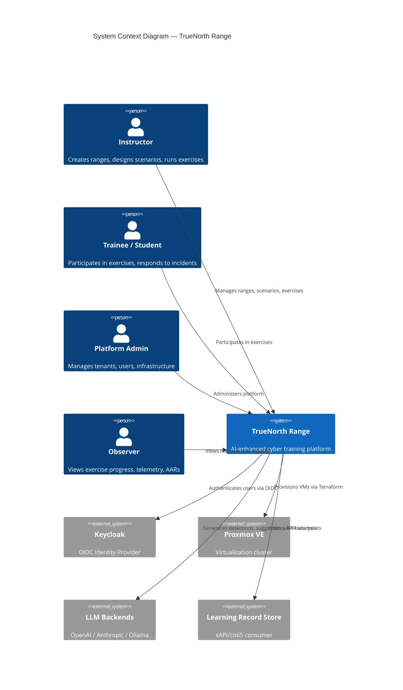

---

## Container Diagram

The platform consists of 12+ deployable containers organized into four layers: client, API, processing, and data.

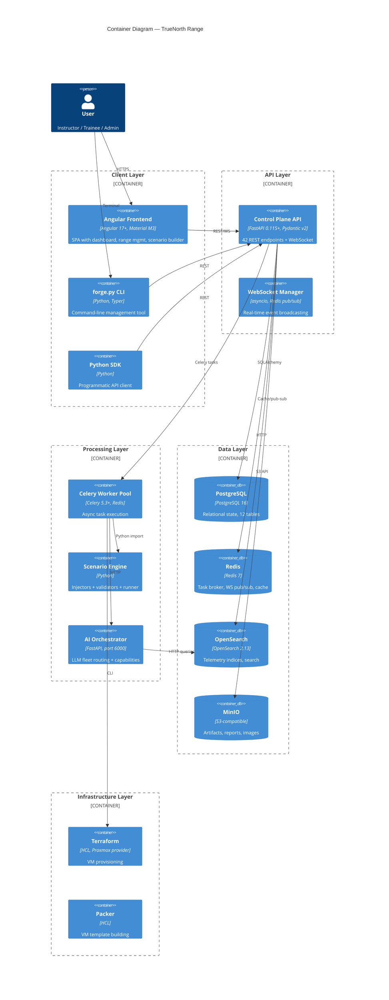

---

## Component Diagrams

### Control Plane API

The API is a FastAPI application organized into 5 router modules with shared authentication, RBAC, and database layers.

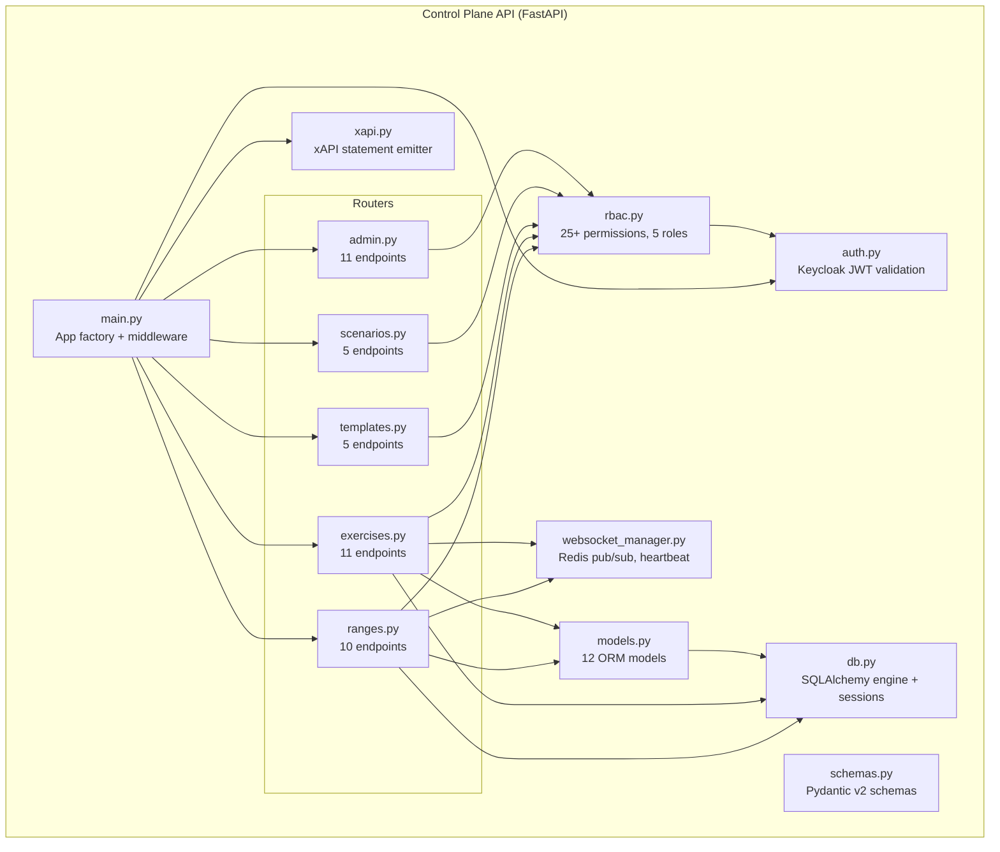

### Worker Pool

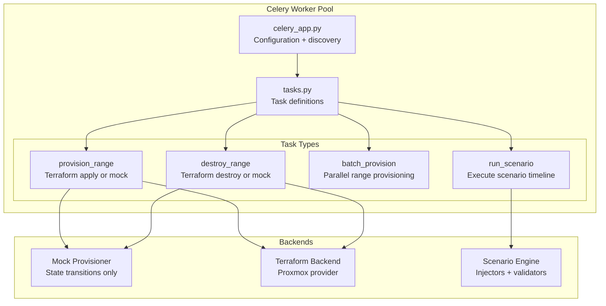

### AI Orchestrator

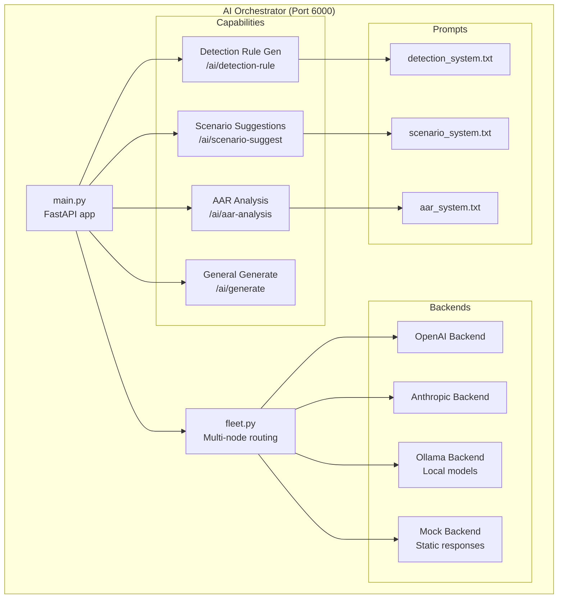

### Scenario Engine

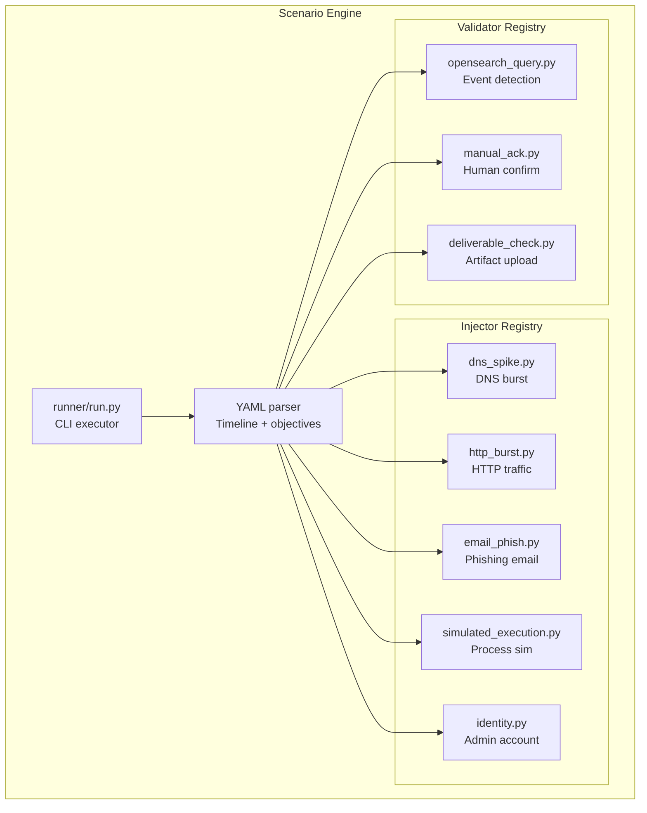

---

## Data Flow Diagrams

### Range Provisioning Flow

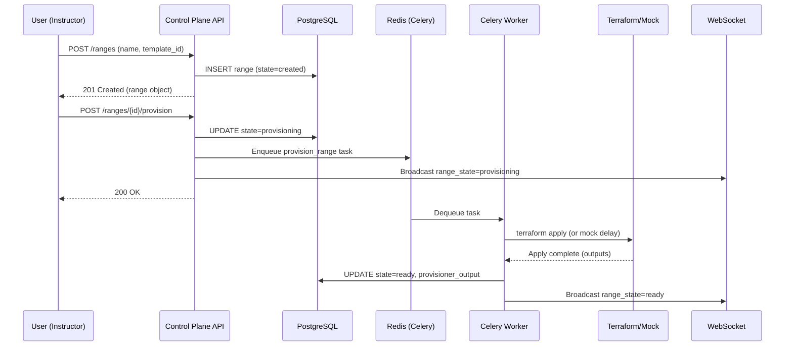

### Exercise Lifecycle Flow

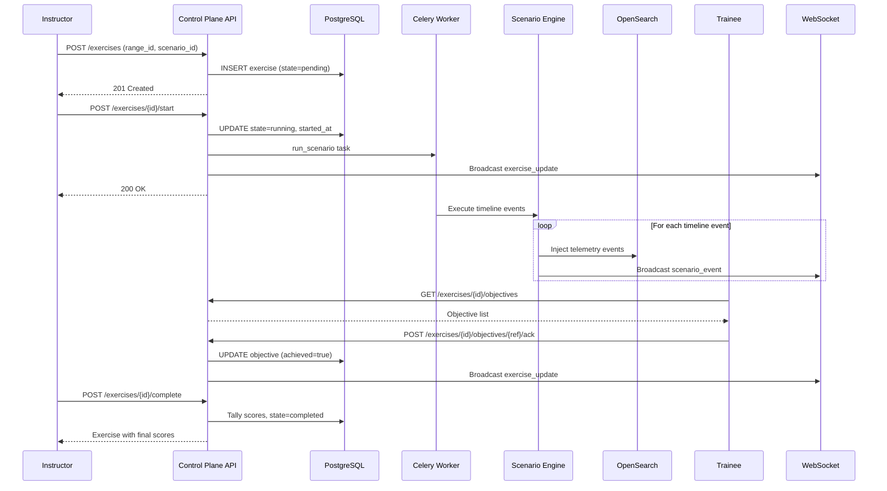

### Telemetry Pipeline Flow

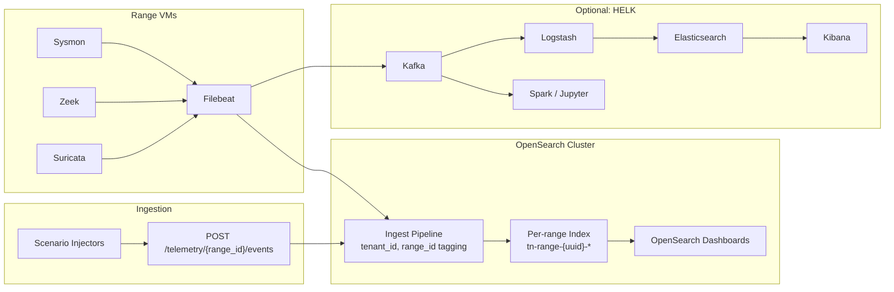

---

## Data Model

The relational data model consists of 12 tables organized around tenant isolation and range/exercise lifecycle management.

```mermaid
erDiagram
    TENANTS ||--o{ USERS : "has"
    TENANTS ||--o{ TEAMS : "has"
    TENANTS ||--o{ RANGES : "owns"
    TENANTS ||--o{ TEMPLATES : "owns"
    TENANTS ||--o{ SCENARIOS : "owns"
    TENANTS ||--o{ EXERCISES : "owns"
    TENANTS ||--o{ AUDIT_LOGS : "generates"

    USERS ||--o{ TEAM_MEMBERSHIPS : "belongs to"
    TEAMS ||--o{ TEAM_MEMBERSHIPS : "contains"

    TEMPLATES ||--o{ RANGES : "instantiates"
    SCENARIOS ||--o{ EXERCISES : "defines"
    RANGES ||--o{ EXERCISES : "hosts"
    EXERCISES ||--o{ OBJECTIVES : "has"
    EXERCISES ||--o| AFTER_ACTION_REPORTS : "generates"

    TENANTS {
        uuid id PK
        string name UK
        string slug UK
        bool is_active
        timestamp created_at
        timestamp updated_at
    }

    USERS {
        uuid id PK
        string keycloak_id UK
        string email UK
        string display_name
        enum role "admin/instructor/student/observer/range_ops"
        uuid tenant_id FK
        bool is_active
    }

    TEAMS {
        uuid id PK
        string name
        uuid tenant_id FK
    }

    TEAM_MEMBERSHIPS {
        uuid id PK
        uuid user_id FK
        uuid team_id FK
        string role
    }

    TEMPLATES {
        uuid id PK
        string name
        string version
        text yaml
        uuid tenant_id FK
        bool is_public
    }

    SCENARIOS {
        uuid id PK
        string name
        string version
        text yaml
        uuid tenant_id FK
        bool is_public
    }

    RANGES {
        uuid id PK
        string name
        uuid template_id FK
        enum state "created/provisioning/ready/running/stopped/destroying/destroyed/failed"
        uuid tenant_id FK
        string provisioner_backend
        text provisioner_output
        text error_message
    }

    EXERCISES {
        uuid id PK
        string name
        uuid range_id FK
        uuid scenario_id FK
        enum state "pending/running/paused/completed/cancelled"
        uuid tenant_id FK
        timestamp started_at
        timestamp completed_at
        int total_score
        int max_score
    }

    OBJECTIVES {
        uuid id PK
        uuid exercise_id FK
        string ref_id
        enum objective_type "detection/response/deliverable"
        text description
        string validator
        text validator_params
        int points
        bool achieved
        text evidence
        timestamp achieved_at
    }

    AFTER_ACTION_REPORTS {
        uuid id PK
        uuid exercise_id FK UK
        text report_json
        text report_html
        timestamp generated_at
    }

    AUDIT_LOGS {
        uuid id PK
        timestamp timestamp
        uuid user_id FK
        uuid tenant_id FK
        string action
        string resource_type
        string resource_id
        text detail
    }
```

### State Machines

**Range States:**
```
created --> provisioning --> ready --> running --> stopped --> destroying --> destroyed
                  |                      |           |                         ^
                  v                      |           |                         |
                failed ------->----------+-----------+--------> destroying --->+
```

Valid transitions defined in `control-plane/api/app/models.py`:
- `created` -> `provisioning`, `destroyed`
- `provisioning` -> `ready`, `failed`
- `ready` -> `running`, `destroying`
- `running` -> `stopped`, `destroying`
- `stopped` -> `running`, `destroying`
- `destroying` -> `destroyed`, `failed`
- `failed` -> `provisioning`, `destroying`, `destroyed`

**Exercise States:**
```
pending --> running --> paused --> running (resume)
               |          |
               v          v
           completed   cancelled
```

Valid transitions:
- `pending` -> `running`, `cancelled`
- `running` -> `paused`, `completed`, `cancelled`
- `paused` -> `running`, `cancelled`
- `completed` -> (terminal)
- `cancelled` -> (terminal)

---

## Technology Decisions

| Decision | Choice | Rationale | Alternatives Considered |
|----------|--------|-----------|------------------------|
| **API Framework** | FastAPI 0.115+ | Async-ready, auto OpenAPI docs, Pydantic v2, excellent performance | Django REST, Flask |
| **ORM** | SQLAlchemy 2.0 | Mature, async-capable, excellent PostgreSQL support, migration ecosystem | Tortoise ORM, raw SQL |
| **Database** | PostgreSQL 16 | ACID compliance, JSON support, excellent tooling, proven at scale | MySQL, CockroachDB |
| **Task Queue** | Celery + Redis | Battle-tested, Python-native, rich monitoring (Flower), retry logic | Dramatiq, Huey, RQ |
| **Auth** | Keycloak 24 OIDC | Enterprise SSO, MFA, LDAP/AD federation, standard OIDC | Auth0, Okta, custom |
| **Search/Telemetry** | OpenSearch 2.13 | Open-source, rich query DSL, dashboards, community support | Elasticsearch, Loki |
| **Object Storage** | MinIO | S3-compatible, self-hosted, lightweight, erasure coding | Ceph, local filesystem |
| **Frontend** | Angular 17+ | Enterprise-grade, Material M3, TypeScript-first, reactive forms | React, Vue, Svelte |
| **IaC** | Terraform + Packer | Declarative, Proxmox provider, reproducible image builds | Ansible, Pulumi |
| **Virtualization** | Proxmox VE | Open-source, KVM/LXC, API-driven, VLAN support, clustering | VMware, OpenStack |
| **AI Integration** | Multi-backend fleet | Provider flexibility, fallback chains, local option (Ollama) | Single vendor lock-in |
| **Container Dev** | Docker Compose | Simple local development, overlay pattern for optional services | Podman, Kind |
| **WebSocket** | FastAPI native + Redis | Native async support, Redis pub/sub for multi-worker fan-out | Socket.IO, Centrifugo |

---

## Scalability Design

### Capacity Targets

| Metric | Target | Design Strategy |
|--------|--------|----------------|
| Concurrent users | 1,200 | Horizontal API scaling, connection pooling, Redis sessions |
| Total VMs | 70,000 | Batch provisioning, Proxmox cluster federation, queue isolation |
| Telemetry events/sec | 100,000 | OpenSearch sharding, bulk ingest, pipeline routing |
| WebSocket connections | 10,000 | Per-user limits (50), Redis pub/sub, graceful degradation |
| Ranges per tenant | 500 | Composite indexes on (tenant_id, state), query optimization |

### Database Partitioning

- **Tenant isolation**: All queries scoped by `tenant_id` with composite indexes
- **Index strategy**: `ix_ranges_tenant_state`, `ix_exercises_tenant_state`, `ix_audit_tenant_ts`
- **Connection pooling**: PgBouncer in transaction mode for production
- **Read replicas**: Secondary PostgreSQL instances for reporting queries

### Queue Isolation

- **Default queue**: API-triggered tasks (CRUD, small operations)
- **Provision queue**: Range provisioning tasks (long-running, resource-intensive)
- **Scenario queue**: Scenario execution tasks (I/O-bound, telemetry generation)
- **AI queue**: LLM inference requests (variable latency, rate-limited)

### Horizontal Scaling

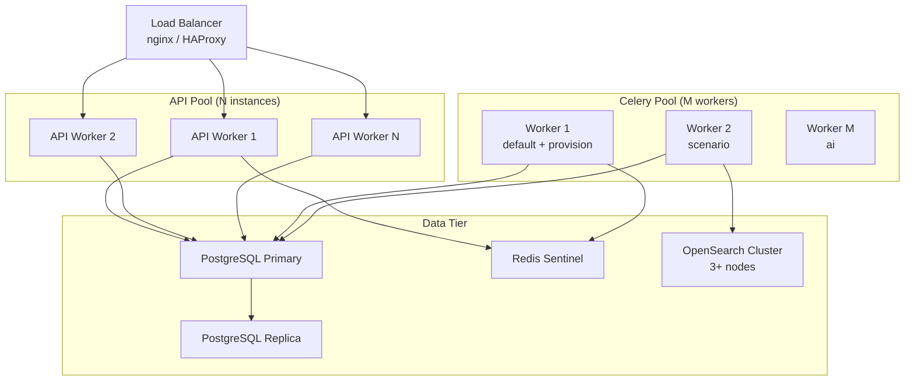

---

## Multi-Tenancy Model

TrueNorth Range enforces tenant isolation at every layer of the stack:

| Layer | Isolation Mechanism |
|-------|-------------------|
| **Authentication** | Keycloak realm per tenant (or shared realm with `tenant_id` claim) |
| **API** | All queries filtered by `user.tenant_id`; admin role bypasses |
| **Database** | `tenant_id` FK on all core tables; composite indexes for performance |
| **Object Storage** | MinIO bucket per tenant: `tn-{tenant_slug}-artifacts` |
| **Telemetry** | OpenSearch index per range: `tn-range-{range_uuid}-*` |
| **Network** | VLAN segmentation per range in Proxmox |
| **RBAC** | Fine-grained permissions mapped to 5 roles per tenant |
| **Audit** | All actions logged with `tenant_id` and `user_id` |

### Tenant Access Control Flow

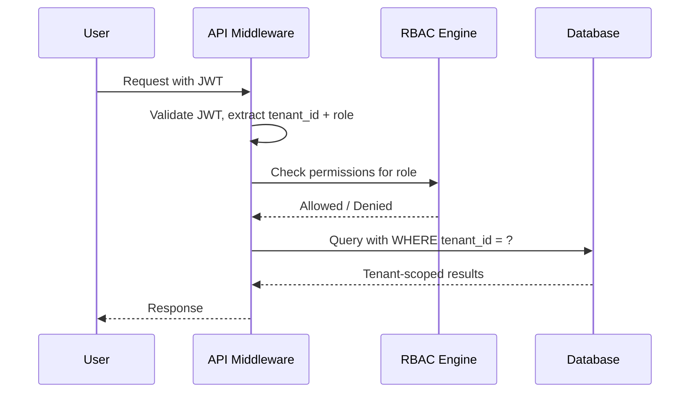

---

## Network Architecture

### Range Network Isolation

Each provisioned range receives dedicated network segmentation:

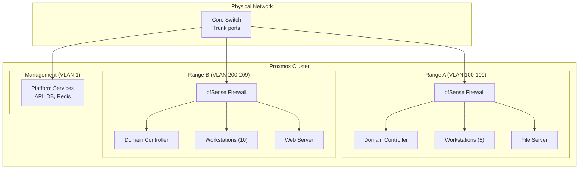

### Firewall Rules

| Rule | Source | Destination | Action | Purpose |
|------|--------|-------------|--------|---------|
| Management access | Platform VLAN | Range VLAN | Allow (SSH, WinRM) | Provisioning and telemetry |
| Range isolation | Range VLAN A | Range VLAN B | Deny | Prevent cross-range access |
| Internet egress | Range VLAN | Internet | Configurable | Controlled internet access |
| Sensor reporting | Range VLAN | OpenSearch | Allow (9200) | Telemetry shipping |
| DNS resolution | Range VLAN | DNS Server | Allow (53) | Name resolution |

---

## AI Architecture

### Fleet Routing

The AI Orchestrator supports multiple LLM backends with intelligent routing:

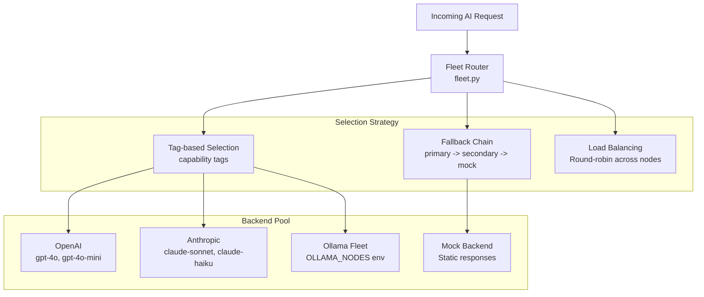

### AI Capabilities

| Capability | Endpoint | Input | Output | Use Case |
|-----------|----------|-------|--------|----------|
| **Detection Rule Gen** | `POST /ai/detection-rule` | Threat description | Sigma-style YAML rule | Automated detection engineering |
| **Scenario Suggest** | `POST /ai/scenario-suggest` | Existing scenario YAML | Modified/enhanced scenario | Scenario variation and difficulty tuning |
| **AAR Analysis** | `POST /ai/aar-analysis` | Exercise data + telemetry | Narrative analysis + recommendations | Automated after-action insights |
| **General Generate** | `POST /ai/generate` | Free-form prompt | Generated text | Flexible AI assistance |

### Ollama Fleet Configuration

```bash
# Environment variable for multi-node Ollama fleet
OLLAMA_NODES=http://gpu-node-1:11434,http://gpu-node-2:11434,http://gpu-node-3:11434

# Tag-based model selection
OLLAMA_DETECTION_MODEL=codellama:7b
OLLAMA_SCENARIO_MODEL=llama3:70b
OLLAMA_AAR_MODEL=mixtral:8x7b
```

---

## Security Architecture

For detailed security documentation, see [security.md](security.md).

### Authentication Flow

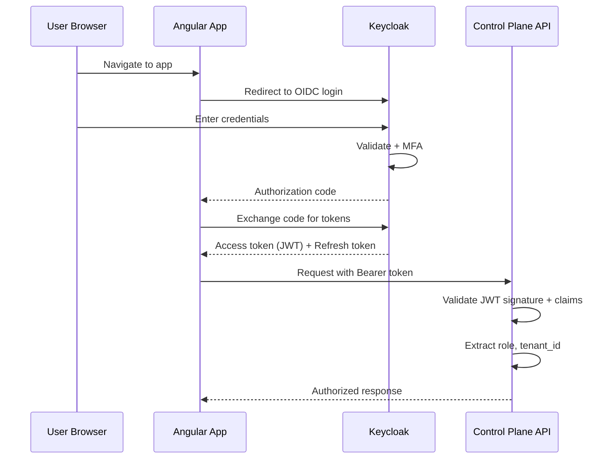

### RBAC Summary

| Role | Key Permissions |
|------|----------------|
| **admin** | All permissions (full platform access) |
| **instructor** | Range lifecycle, scenario CRUD, exercise management, AAR generation |
| **range_ops** | Infrastructure-focused: range CRUD, provisioning, templates |
| **student** | Read ranges/templates/scenarios, start/complete exercises, view AARs |
| **observer** | Read-only access to all resources plus telemetry |

See `control-plane/api/app/rbac.py` for the complete 25-permission matrix.