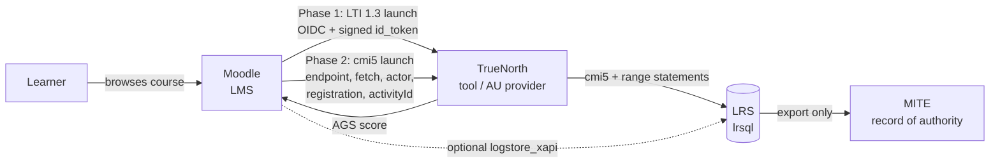

# Moodle integration (LTI 1.3 now, cmi5 next)

> **Status:** design. The security fixes it depends on have been made (commit `25b4a89`). The
> integration itself isn't built. Written 2026-09-23.
>
> **Reference:** `docs/xAPI CMI5 Reference/xapi-cmi5-kb/` (the owner's knowledge pack). This doc
> cites it by section (for example "KB §9.3") instead of repeating it. Check the pack's §19
> (confidence and gaps) before quoting anything.

## Decisions

| Question | Decision |
|---|---|
| Who is the learner-facing LMS? | **Moodle.** TrueNorth is the *tool/content provider*. |
| Phase 1 | **LTI 1.3**: launch into TrueNorth from Moodle, and send grades back to Moodle's gradebook. Moodle core supports it through "External tool", with no plugin. TrueNorth's side is ~80% built. |
| Phase 2 | **cmi5**: TrueNorth quizzes and range exercises become cmi5 Assignable Units (AUs), launched by a Moodle cmi5 activity plugin. TrueNorth exports a `cmi5.xml` per course. |
| Custom Moodle PHP plugin? | **Not now.** Revisit only if catalogue sync is needed (see Open decisions). |
| Record of authority | **MITE**, unchanged. The LMS and LRS never mark a qualification granted (`truenorth-content-pack/truenorth-content/lms/xapi_mapping.md`). |
| LRS | **SQL LRS (`yetanalytics/lrsql`)**, already in the dev and prod compose files, on PostgreSQL in prod (KB §11.2). |

## Architecture



The whole chain is on-prem. The content pack's operating rules forbid calling any external or
cloud API, and forbid sending scenario data off the box. So Moodle, the LRS and TrueNorth all run
inside the same boundary (KB §13.7).

## Mapping

| TrueNorth | Moodle | cmi5 |
|---|---|---|
| Qualification (NQual) / programme | Course, or a course category | Course |
| `Course` | Course | Course (`cmi5.xml`) |
| `CourseModule` (delivers one PO) | Activity in a section | Block or AU |
| `Quiz`, assessment `Exercise` | External-tool activity (P1) / cmi5 activity (P2) | AU, `masteryScore = CourseModule.pass_threshold / 100` |
| `Enrollment` | Enrolment | Registration (learner × course, KB §13.3) |
| AGS line item | Gradebook item | — |
| `mite_course_code` + `po_code` | — | Publisher activity ID `https://ccoe.forces.gc.ca/xapi/mite/<MITE_CODE>/po/<PO_ID>` (`xapi_mapping.md`) |

`qsp_progress.py` already rolls EO → PO → Module → NQual up, as `xapi_mapping.md` describes.
A PO counts as met when its module's progress reaches `pass_threshold`. That is the same rule a
cmi5 `moveOn` of `Passed` expresses, so the two agree without new logic.

## What already exists

| Piece | Where | State |
|---|---|---|
| LTI 1.3 tool: OIDC login, JWKS, launch validation, Deep Linking, AGS push | `control-plane/api/app/lti13.py`, `routers/integrations.py` (`/lti/*`) | Built. Hardened and tested in `25b4a89` |
| Platform registry and learning records | `ExternalPlatform`, `ExternalActivity`, `LTILaunch`, `LTINonce`, `LTIToolKey` (`models.py`) | Built |
| xAPI emitter and pluggable LRS backend | `app/xapi.py`, `app/lms/` (`xapi_lrs`, `null`) | Built. **Not cmi5-conformant** (see below) |
| Local Moodle for testing | `infra/platform/docker/compose.moodle.yml` (Moodle 4.4 on :8083) | Built |
| Quiz export to Moodle | `GET /quizzes/{id}/export?format=gift\|moodlexml` | Built. The UI link sends no bearer token |
| cmi5 AU with no dependencies, tested 9/9 | KB `au/cmi5-au.js` | Reference code to adopt |
| LRS smoke test, cmi5 session simulator | KB `scripts/lrs-smoke-test.sh`, `scripts/cmi5-session-sim.sh` | Reference tooling |

### Security prerequisites (done: `25b4a89`)

Any integration would have widened each of these holes. All are closed, with negative tests
(`tests/api/test_integrations_authz.py`, `tests/api/test_lti13.py`):

- **Platform registration was open to any logged-in user.** Anyone could register a platform or repoint its JWKS URL, and that URL decides who may sign users in. It now needs `integration:write`, which only admins hold.
- **The LTI launch trusted the token's own audience** when no client id was registered. It also never checked `deployment_id`. Both must now come from the registration.
- **`_jit_user` matched the platform-asserted email across tenants.** Email is globally unique, so a registered platform could sign in as any user, admins included. Matching is now restricted to the platform's own tenant; any other match is refused.
- **Learning records had no tenant predicate.** Enrolments, progress, transcripts, external activities and `POST /lti/grades` now follow one rule: your own record always; anyone else's needs `learning_record:read` or `learning_record:write`, *and* that person must be in your tenant.
- **`lti_auth_login_url` was missing from the platform schemas**, so a Moodle platform could never start a launch.

## Phase 1: LTI 1.3

### Configuration

In Moodle, go to *Site administration → Plugins → External tool → Manage tools*, choose
**LTI 1.3**, and enter the tool URLs. The comments in `compose.moodle.yml` list them:

| Moodle field | TrueNorth URL |
|---|---|
| Tool URL | `<api>/lti/launch` |
| Initiate login URL | `<api>/lti/login` |
| Public keyset URL | `<api>/lti/jwks` |
| Redirection URI(s) | `<api>/lti/launch` |
| Deep Linking | enabled, same launch URL |

Then register Moodle in TrueNorth as an **admin**, using the values Moodle shows once the tool
is activated:

```http
POST /integrations/platforms
{
  "name": "Moodle", "slug": "moodle", "platform_type": "moodle", "auth_type": "lti13",
  "base_url": "https://moodle.example",
  "lti_issuer": "https://moodle.example",
  "lti_client_id": "<client id from Moodle>",
  "lti_deployment_id": "<deployment id from Moodle>",
  "lti_auth_login_url": "https://moodle.example/mod/lti/auth.php",
  "lti_token_url": "https://moodle.example/mod/lti/token.php",
  "lti_jwks_url": "https://moodle.example/mod/lti/certs.php"
}
```

Launches are refused unless `lti_client_id` and `lti_deployment_id` are both set.

> Moodle's menu paths and URL names above come from general knowledge of Moodle 4.x, not from
> the reference pack (which covers Moodle only as `logstore_xapi`). Check them against the
> `compose.moodle.yml` instance before anyone relies on them.

### Gaps to close before Phase 1 works end to end

| # | Gap | Evidence | Fix |
|---|---|---|---|
| 1 | **An LTI-created user can't sign in to the web app.** `/lti/launch` JIT-creates a user whose `keycloak_id` is `lti:<platform>:<sub>`, then redirects into an SPA that Keycloak guards. That user has no Keycloak identity. | `routers/integrations.py` `_jit_user`, `lti_launch` | Make an LTI session hand-off: a short-lived, single-use launch token that the SPA exchanges for a session. Or federate: create or link the Keycloak user during the launch. Decide per tenant; see Open decisions. |
| 2 | **AGS passback identifies the learner by `users.id`**, taken from the launch. It only reaches the right gradebook row if the person who submits is the same user row. | `lti13.push_score_for_resource` | This falls out of #1. Once the launched user is the one who submits, the ids agree. |
| 3 | **Launch redirects go to `/training?quiz=` and `/exercises?exercise=`.** `/training` is now a redirect that drops `quiz=`; only `/quiz-player?quiz=` reads it. | `lti_launch` target URLs; `app.routes.ts` | Point quizzes at `/quiz-player?quiz=<id>`. Course launches already work: `/training?course=` now lands on the course page (commit `c5f4a5b`). |
| 4 | **Exercises aren't attributable to a trainee.** `Exercise` has no learner column, so exercise statements and grades name the instructor who clicked. | `models.py` `Exercise`; `routers/exercises.py` emit sites | Add a participant or learner link (per trainee per run, KB §13.3 and §17). This also blocks Phase 2 for exercises. |
| 5 | **The web UI advertises the wrong tool URLs**: `/api/v1/lti/*` (routes have no `/v1`) and a nonexistent `/lti/deeplink`. It also offers `platform_type` `lti_generic`, which the schema rejects. | `features/integrations/integrations.component.ts:91,170-174` | Show the real paths; drop `lti_generic` or add it to the schema. |
| 6 | **Prod sets no `LTI_TOOL_BASE_URL` or `LTI_WEB_BASE_URL`**, so both fall back to localhost. The dev defaults also disagree: `.env.example` and the Moodle harness's tool URLs use :8980, but `compose.dev.yml` exposes the API on :8081. | `infra/platform/docker/compose.prod.yml`; `.env.example` | Add both to prod compose and `env.production.j2`; pick one dev port. |
| 7 | **The quiz export link sends no bearer token**, so it fails once auth is on. | `curriculum-forge.component.ts` (`<a href>` to `/quizzes/{id}/export`) | Download through `ApiService` as a blob. |

### Acceptance

1. `compose.moodle.yml` up; register Moodle through the API with `lti_auth_login_url`. A student token gets 403 on the same call.
2. From Moodle, Deep Link a published quiz into a course.
3. As a Moodle learner: launch, sign in once through the hand-off, take the quiz. The score appears in Moodle's gradebook.
4. Replay the same `id_token`: refused. Launch from a second Moodle deployment that isn't registered: refused.

## Phase 2: cmi5

TrueNorth becomes a cmi5 **content provider**. Moodle and a cmi5 activity plugin act as the
LMS: they launch AUs and issue `launched` / `satisfied` / `abandoned` / `waived`. TrueNorth's AUs
issue `initialized` / `completed` / `passed` / `failed` / `terminated` (KB §9.3, §9.9). The
sequence is in KB §9.3.

### 2a. Course structure export

`GET /courses/{id}/cmi5.xml` should return a Quartz course structure (KB §9.14, and
`examples/cmi5.xml` in the pack):

- One `<course>`. One `<block>` per module grouping if needed. One `<au>` per quiz or
  assessment exercise.
- **Every `<url>` fully qualified.** A bare `cmi5.xml` with no ZIP must use fully qualified URLs
  (cmi5 spec §14).
- `moveOn="Passed"` for assessments; `masteryScore = pass_threshold / 100`; `launchMethod="AnyWindow"`.
- Publisher IDs under the MITE scheme, stable across minor revisions (KB §13.2). The LMS mints
  its own runtime activity IDs; never use the publisher ID as `object.id` at runtime.
- Validate the output against `CourseStructure.xsd` in a test.

### 2b. AU runtime in the SPA

Add a route, for example `/au/:kind/:id`, that:

1. reads `endpoint`, `fetch`, `actor`, `registration` and `activityId` from the query (KB §9.4);
2. POSTs **once** to `fetch` for the auth token (KB §9.5), and never stores it beyond the session;
3. GETs `LMS.LaunchData` for `launchMode`, `masteryScore`, `moveOn` and `returnURL` (KB §9.6);
4. sends `initialized`, then runs the quiz or exercise;
5. sends `completed` / `passed` / `failed` with `result.duration` and the `masteryscore` extension, then `terminated`, then returns to `returnURL` (KB §9.10–9.12).

**Adopt `au/cmi5-au.js`** from the pack rather than writing a client or adding
`@rusticisoftware/cmi5`. It has no dependencies and is already tested, and `docs/AGENTS.md`
asks for a reason before adding any dependency. In Browse or Review mode, send only
`initialized` and `terminated`.

### 2c. Range exercises

This follows KB §17: the AU is the launch point, the range backend reports outcomes, and the AU
(holding the session token) sends `completed`/`passed`. Use one registration per trainee per
exercise run. Range-side statements carry the cmi5 context template. This depends on gap #4
(exercise attribution).

### 2d. Make `app/xapi.py` conformant

| Today (`app/xapi.py`) | Required |
|---|---|
| `actor.mbox = mailto:<email>` plus `name` (line 35) | `account {homePage: <TrueNorth identity authority>, name: <users.id>}`, no name. Emails are forbidden as the cmi5 actor, and hashing them is not anonymisation (KB §13.1). |
| Object IDs `http://truenorthrange.local/...` (line 51) | The MITE scheme from `xapi_mapping.md` for publisher IDs; the LMS-issued `activityId` at runtime. |
| No `context.registration` | The launch registration, on every statement. |
| No cmi5 context | Category `…/cmi5/context/categories/cmi5`; `moveon` on `completed`/`passed`/`failed`; the `sessionid` extension (KB §9.8, §9.12). |
| No `result.duration`; success fixed at `>= 0.7` (line 127) | Duration on `completed`/`passed`/`failed`/`terminated`; pass/fail against the launch `masteryScore`. |
| `en-US` language maps (lines 43, 54, 84) | `en-CA` (and `fr-CA` where content exists). |
| Content-pack `xapi.json` templates lack `account.homePage` | Add it. xAPI rejects an `account` without it. |
| `component_version` pinned `v2.1.0` in `xapi_mapping.md` | `SP800-181r1`, as `docs/current-state.md` already corrected. |

Changing the actor is a **data migration question** as well as a code change. Existing LRS
statements identify people by email. Decide whether to leave them, or to void and re-issue them
(KB §5.10), before switching.

### 2e. LRS configuration (KB §11.2, §13.6)

- PostgreSQL-backed lrsql in prod, with **1.0.3 and 2.0.0 both enabled**. cmi5 content speaks 1.0.3.
- Per-client, least-privilege credentials: write-only for TrueNorth's server-side producers, read-only for dashboards. **No long-lived LRS credential in the browser**; the AU uses only the cmi5 per-session token.
- Retention set in LRS config, not by convention. The LRS holds personal information, so a privacy impact assessment and a retention schedule apply (KB §13.1).
- Optional: Moodle's `logstore_xapi` forwards Moodle's own events into the same LRS, giving one record across both systems.

### Acceptance

1. `scripts/lrs-smoke-test.sh` passes 14/14 against TrueNorth's lrsql with both version headers.
2. `scripts/cmi5-session-sim.sh` completes end to end. With `LMS_ONLY=1`, it launches TrueNorth's real AU.
3. CATAPULT **CTS** passes for TrueNorth's AUs, and CATAPULT **LTS** passes for the chosen Moodle cmi5 plugin (KB §11.1).
4. A trainee's quiz AU in Moodle produces `launched → initialized → passed → terminated → satisfied` under one registration, with an `account` actor and no email anywhere.

## Constraints

- **Air-gapped.** Nothing leaves the box, and the reference IRIs (`w3id.org`, `adlnet.gov`) are identifiers, not network dependencies (KB §13.7).
- **Anything mounted under `/xapi` is pre-exempted** by `tests/api/test_auth_coverage_guard.py` (`PUBLIC_PREFIXES`), on the assumption that it has its own credential. A cmi5 fetch endpoint or LRS proxy placed there **must** enforce that credential itself, because the guard will not catch it.
- **No service-account scheme exists** for Moodle to call TrueNorth's API. `IntegrationAuthType.api_key` and `oauth2` are enum values with nothing behind them.

## Open decisions

1. **The LTI session hand-off (gap #1):** an exchangeable single-use token, or Keycloak federation of LTI users? Federation keeps one identity model but couples Moodle onboarding to Keycloak.
2. **Which Moodle cmi5 plugin to standardise on.** Choose on CATAPULT LTS results, not the feature list.
3. **A custom `local_truenorth` Moodle plugin** would only be needed to sync TrueNorth's catalogue (courses, a section per PO, competencies) into Moodle automatically. Deep Linking covers placing individual activities without it.
4. **Machine-to-machine auth, if Moodle ever calls TrueNorth:** a Keycloak `client_credentials` client mapped to a tenant-scoped service user, or a new API-key scheme.
5. **Existing email-identified LRS statements** when the actor changes (see 2d).
