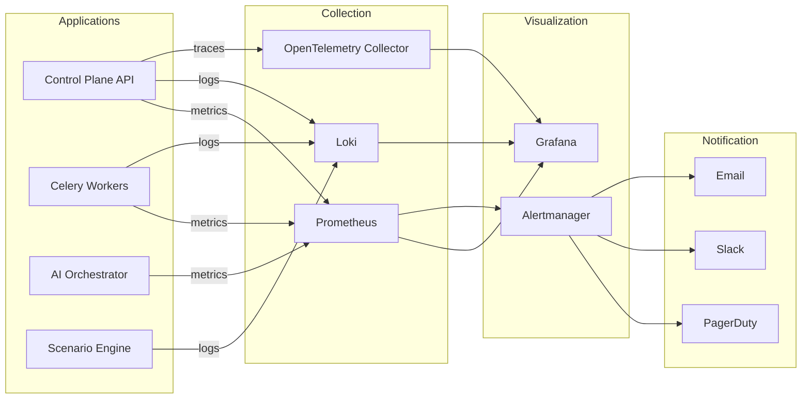

# TrueNorth Range — Operations Guide

> Day-to-day operations, monitoring, alerting, backup/restore, scaling, and disaster-recovery runbooks for production TrueNorth Range deployments.

---

## Table of Contents

- [Daily Operations Checklist](#daily-operations-checklist)
- [Monitoring Architecture](#monitoring-architecture)
- [Dashboard Reference](#dashboard-reference)
- [Alert Response Procedures](#alert-response-procedures)
- [Backup and Restore](#backup-and-restore)
- [Database Maintenance](#database-maintenance)
- [Scaling Operations](#scaling-operations)
- [Log Management](#log-management)
- [Certificate Management](#certificate-management)
- [Disaster Recovery](#disaster-recovery)
- [Runbook: Common Issues](#runbook-common-issues)
- [Capacity Planning](#capacity-planning)
- [Change Management](#change-management)

---

## Daily Operations Checklist

### Morning Health Check (~10 minutes)

| # | Task | Command / Action | Expected Result |
|---|------|-----------------|----------------|
| 1 | Check API health | `curl https://api.truenorth.local/healthz` | `{"status": "healthy"}` |
| 2 | Check Worker health | `celery -A celery_app inspect ping` | All workers respond |
| 3 | Check PostgreSQL | `pg_isready -h db.truenorth.local` | `accepting connections` |
| 4 | Check Redis | `redis-cli -h redis.truenorth.local ping` | `PONG` |
| 5 | Check OpenSearch | `curl https://opensearch.truenorth.local:9200/_cluster/health` | `"status": "green"` |
| 6 | Check MinIO | `mc admin info truenorth-minio` | All nodes online |
| 7 | Check Keycloak | `curl https://auth.truenorth.local/health/ready` | `{"status": "UP"}` |
| 8 | Check AI Orchestrator | `curl http://ai-orchestrator:6000/health` | `{"status": "ok"}` |
| 9 | Review active ranges | Dashboard: Active Ranges panel | No stuck states |
| 10 | Review error logs | Grafana Loki: `{app="truenorth"} |= "ERROR"` last 24h | No unexpected errors |

### Weekly Maintenance (~30 minutes)

| Task | When | Procedure |
|------|------|-----------|
| Database vacuum | Sunday 02:00 UTC | Automated via cron; verify completion |
| Certificate expiry check | Monday | `openssl x509 -enddate -noout -in /etc/ssl/truenorth.crt` |
| Disk usage review | Monday | `df -h` on all nodes; alert if >80% |
| Backup verification | Tuesday | Restore latest backup to test environment |
| Security scan | Wednesday | Run Trivy against container images |
| Log rotation verify | Thursday | Check logrotate ran successfully |
| Dependency update review | Friday | Check for CVEs in dependencies |

### Monthly Tasks

| Task | Procedure |
|------|-----------|
| Load test | Run k6 load test against staging |
| DR drill | Execute disaster recovery runbook |
| Access review | Audit Keycloak user accounts and role assignments |
| Capacity review | Review Grafana trends for growth planning |
| Packer image rebuild | Rebuild base images with latest OS patches |

---

## Monitoring Architecture



### Metrics Endpoints

| Service | Metrics URL | Port |
|---------|------------|------|
| Control Plane API | `/metrics` | 8080 |
| Celery Workers | `/metrics` (flower) | 5555 |
| AI Orchestrator | `/metrics` | 6000 |
| PostgreSQL | postgres_exporter | 9187 |
| Redis | redis_exporter | 9121 |
| OpenSearch | opensearch_exporter | 9114 |
| MinIO | `/minio/v2/metrics/cluster` | 9000 |
| Node Exporter | `/metrics` | 9100 |

---

## Dashboard Reference

### 1. Platform Overview Dashboard

**Purpose:** High-level health and throughput.

| Panel | Metric | Thresholds |
|-------|--------|-----------|
| API Request Rate | `rate(http_requests_total[5m])` | Warn: >500 rps |
| API Latency P99 | `histogram_quantile(0.99, ...)` | Warn: >500ms, Crit: >2s |
| Error Rate | `rate(http_requests_total{status=~"5.."}[5m])` | Warn: >1%, Crit: >5% |
| Active Ranges | `truenorth_ranges_active` | Info only |
| Active Exercises | `truenorth_exercises_active` | Info only |
| WebSocket Connections | `truenorth_ws_connections` | Warn: >8000 |
| Celery Queue Depth | `celery_queue_length` | Warn: >100, Crit: >500 |

### 2. Infrastructure Dashboard

| Panel | Metric | Thresholds |
|-------|--------|-----------|
| CPU Usage | `node_cpu_seconds_total` | Warn: >80%, Crit: >95% |
| Memory Usage | `node_memory_MemAvailable_bytes` | Warn: <20%, Crit: <5% |
| Disk Usage | `node_filesystem_avail_bytes` | Warn: >80%, Crit: >90% |
| PostgreSQL Connections | `pg_stat_activity_count` | Warn: >80% of max |
| Redis Memory | `redis_memory_used_bytes` | Warn: >80% of maxmemory |
| OpenSearch Cluster Health | `opensearch_cluster_status` | Crit: "red" |

### 3. Provisioning Dashboard

| Panel | Metric | Thresholds |
|-------|--------|-----------|
| Provision Duration | `truenorth_provision_duration_seconds` | Warn: >10min, Crit: >30min |
| Provision Success Rate | `truenorth_provision_total{status="success"}` | Crit: <95% |
| Active Terraform Runs | `truenorth_terraform_active` | Warn: >10 concurrent |
| VM Count by State | `truenorth_vms_by_state` | Info only |
| Destroy Duration | `truenorth_destroy_duration_seconds` | Warn: >5min |

### 4. AI Orchestrator Dashboard

| Panel | Metric | Thresholds |
|-------|--------|-----------|
| AI Request Rate | `ai_requests_total` | Info only |
| AI Latency P95 | `ai_request_duration_seconds` | Warn: >5s, Crit: >30s |
| Backend Availability | `ai_backend_healthy` | Crit: any backend down |
| Token Usage | `ai_tokens_total` | Info (cost tracking) |
| Queue Depth | `ai_queue_depth` | Warn: >50 |

---

## Alert Response Procedures

### Critical Alerts

#### CRIT: API 5xx Rate > 5%

```
Severity: Critical
Condition: rate(http_requests_total{status=~"5.."}[5m]) / rate(http_requests_total[5m]) > 0.05
```

**Response:**
1. Check API logs: `kubectl logs -l app=truenorth-api --tail=100`
2. Check database connectivity: `pg_isready`
3. Check Redis: `redis-cli ping`
4. If DB issue: Check connection pool: `SELECT count(*) FROM pg_stat_activity;`
5. If Redis issue: Check memory: `redis-cli info memory`
6. If code issue: Roll back to previous deployment
7. Escalate if not resolved in 15 minutes

#### CRIT: PostgreSQL Down

```
Severity: Critical
Condition: pg_up == 0
```

**Response:**
1. Check PostgreSQL service: `systemctl status postgresql`
2. Check disk space: `df -h /var/lib/postgresql`
3. Check logs: `journalctl -u postgresql --since "10 minutes ago"`
4. If OOM: Increase `shared_buffers` or add memory
5. If disk full: Emergency cleanup or expand volume
6. If corruption: Initiate failover to replica
7. Notify all teams — this affects all services

#### CRIT: OpenSearch Cluster Red

**Response:**
1. Check cluster health: `curl localhost:9200/_cluster/health?pretty`
2. Identify unassigned shards: `curl localhost:9200/_cat/shards?v&h=index,shard,state,unassigned.reason`
3. Check node status: `curl localhost:9200/_cat/nodes?v`
4. If node down: Restart node, wait for shard recovery
5. If disk full: Clear old indices: `curl -X DELETE localhost:9200/tn-range-*-2024.01.*`
6. If persistent: Enable shard allocation: `curl -X PUT localhost:9200/_cluster/settings -d '{"persistent":{"cluster.routing.allocation.enable":"all"}}'`

### Warning Alerts

#### WARN: Celery Queue Depth > 100

**Response:**
1. Check worker status: `celery -A celery_app inspect active`
2. Check for stuck tasks: `celery -A celery_app inspect reserved`
3. If workers are healthy: Scale workers `kubectl scale deployment celery-worker --replicas=N`
4. If tasks stuck: Purge and retry: `celery -A celery_app purge`
5. Monitor queue depth returning to normal

#### WARN: WebSocket Connections > 8000

**Response:**
1. Check per-user connection counts in Redis
2. Identify users with excessive connections (limit is 50/user)
3. Force disconnect stale connections via admin API
4. If legitimate load: Scale API replicas
5. Review WebSocket heartbeat settings (30s interval, 3 missed = disconnect)

#### WARN: Disk Usage > 80%

**Response:**
1. Identify large directories: `du -sh /* | sort -rh | head -20`
2. Clean Docker images: `docker system prune -a`
3. Rotate/compress old logs: `logrotate -f /etc/logrotate.d/truenorth`
4. Clean old OpenSearch indices (per retention policy)
5. Clean old MinIO artifacts
6. If persistent: Expand volume

---

## Backup and Restore

### Backup Strategy

| Component | Method | Frequency | Retention |
|-----------|--------|-----------|-----------|
| PostgreSQL | pg_dump + WAL archiving | Continuous WAL, daily full | 30 days full, 7 days WAL |
| Redis | RDB snapshots | Every 15 minutes | 24 hours |
| MinIO | mc mirror to backup bucket | Daily incremental | 90 days |
| OpenSearch | Snapshot to S3 | Daily | 30 days |
| Keycloak | PostgreSQL backup (shared) | With database backup | 30 days |
| Terraform State | S3 backend with versioning | Every apply | indefinite |
| Configuration | Git repository | Every commit | indefinite |

### PostgreSQL Backup

```bash
# Automated daily backup (via cron)
#!/bin/bash
TIMESTAMP=$(date +%Y%m%d_%H%M%S)
BACKUP_DIR="/backups/postgresql"

# Full dump with compression
pg_dump -Fc -h localhost -U truenorth truenorth_db \
  > "${BACKUP_DIR}/truenorth_${TIMESTAMP}.dump"

# Verify backup
pg_restore --list "${BACKUP_DIR}/truenorth_${TIMESTAMP}.dump" > /dev/null 2>&1
if [ $? -eq 0 ]; then
  echo "Backup verified: truenorth_${TIMESTAMP}.dump"
else
  echo "ERROR: Backup verification failed!" | tee -a /var/log/backup-errors.log
  # Send alert
fi

# Clean old backups (> 30 days)
find "${BACKUP_DIR}" -name "*.dump" -mtime +30 -delete

# Upload to offsite storage
mc cp "${BACKUP_DIR}/truenorth_${TIMESTAMP}.dump" offsite/backups/postgresql/
```

### PostgreSQL Restore

```bash
# Stop application services
kubectl scale deployment truenorth-api --replicas=0
kubectl scale deployment celery-worker --replicas=0

# Restore from backup
pg_restore -h localhost -U truenorth -d truenorth_db \
  --clean --if-exists \
  /backups/postgresql/truenorth_20260115_020000.dump

# Verify data integrity
psql -h localhost -U truenorth -d truenorth_db \
  -c "SELECT count(*) FROM ranges; SELECT count(*) FROM exercises;"

# Restart services
kubectl scale deployment truenorth-api --replicas=3
kubectl scale deployment celery-worker --replicas=4
```

### OpenSearch Backup

```bash
# Register snapshot repository
curl -X PUT "localhost:9200/_snapshot/truenorth_backups" -d '{
  "type": "s3",
  "settings": {
    "bucket": "truenorth-opensearch-backups",
    "region": "us-east-1"
  }
}'

# Create snapshot
curl -X PUT "localhost:9200/_snapshot/truenorth_backups/snapshot_$(date +%Y%m%d)"

# Restore snapshot
curl -X POST "localhost:9200/_snapshot/truenorth_backups/snapshot_20260115/_restore" -d '{
  "indices": "tn-range-*",
  "rename_pattern": "(.+)",
  "rename_replacement": "restored_$1"
}'
```

### MinIO Backup

```bash
# Mirror to backup location
mc mirror --overwrite truenorth-minio/truenorth-artifacts backup-minio/truenorth-artifacts

# Verify integrity
mc diff truenorth-minio/truenorth-artifacts backup-minio/truenorth-artifacts
```

---

## Database Maintenance

### PostgreSQL Maintenance

#### Automated VACUUM

```sql
-- Check tables needing vacuum
SELECT schemaname, relname, last_vacuum, last_autovacuum, n_dead_tup
FROM pg_stat_user_tables
ORDER BY n_dead_tup DESC;

-- Manual vacuum for large tables (run during low-traffic window)
VACUUM (VERBOSE, ANALYZE) ranges;
VACUUM (VERBOSE, ANALYZE) exercises;
VACUUM (VERBOSE, ANALYZE) audit_logs;
```

#### Index Maintenance

```sql
-- Check index usage
SELECT
  indexrelname,
  idx_scan,
  idx_tup_read,
  idx_tup_fetch,
  pg_size_pretty(pg_relation_size(indexrelid)) AS index_size
FROM pg_stat_user_indexes
ORDER BY idx_scan ASC;

-- Reindex bloated indexes (run during maintenance window)
REINDEX INDEX CONCURRENTLY idx_ranges_tenant;
REINDEX INDEX CONCURRENTLY idx_exercises_range;

-- Check for unused indexes (candidates for removal)
SELECT indexrelname, idx_scan
FROM pg_stat_user_indexes
WHERE idx_scan = 0 AND indexrelname NOT LIKE 'pk_%';
```

#### Connection Pool Monitoring

```sql
-- Current connections by state
SELECT state, count(*)
FROM pg_stat_activity
WHERE datname = 'truenorth_db'
GROUP BY state;

-- Kill long-running queries (> 5 minutes)
SELECT pg_terminate_backend(pid)
FROM pg_stat_activity
WHERE state = 'active'
  AND query_start < now() - interval '5 minutes'
  AND query NOT LIKE '%pg_stat%';
```

### OpenSearch Maintenance

#### Index Lifecycle Management

```bash
# Create ILM policy
curl -X PUT "localhost:9200/_plugins/_ism/policies/truenorth-ilm" -d '{
  "policy": {
    "description": "TrueNorth Range index lifecycle",
    "default_state": "hot",
    "states": [
      {
        "name": "hot",
        "actions": [],
        "transitions": [
          {"state_name": "warm", "conditions": {"min_index_age": "7d"}}
        ]
      },
      {
        "name": "warm",
        "actions": [{"force_merge": {"max_num_segments": 1}}],
        "transitions": [
          {"state_name": "delete", "conditions": {"min_index_age": "30d"}}
        ]
      },
      {
        "name": "delete",
        "actions": [{"delete": {}}],
        "transitions": []
      }
    ]
  }
}'
```

---

## Scaling Operations

### Horizontal Scaling Guide

| Component | Scale Trigger | Scale Action | Max Recommended |
|-----------|--------------|-------------|-----------------|
| API Replicas | CPU >70% or P99 >500ms | Add replica | 10 replicas |
| Celery Workers | Queue >100 for 5 min | Add worker | 20 workers |
| OpenSearch | Disk >70% or CPU >80% | Add data node | 12 nodes |
| PostgreSQL | Connection >80% | Add PgBouncer | 1 primary + 3 read replicas |
| Redis | Memory >80% | Scale vertically | 64GB RAM |
| AI Orchestrator | Queue >50 | Add replica | 5 replicas |

### Kubernetes Autoscaling

```yaml
# HPA for Control Plane API
apiVersion: autoscaling/v2
kind: HorizontalPodAutoscaler
metadata:
  name: truenorth-api
spec:
  scaleTargetRef:
    apiVersion: apps/v1
    kind: Deployment
    name: truenorth-api
  minReplicas: 3
  maxReplicas: 10
  metrics:
    - type: Resource
      resource:
        name: cpu
        target:
          type: Utilization
          averageUtilization: 70
    - type: Pods
      pods:
        metric:
          name: http_request_duration_seconds_p99
        target:
          type: AverageValue
          averageValue: "500m"

---
# HPA for Celery Workers
apiVersion: autoscaling/v2
kind: HorizontalPodAutoscaler
metadata:
  name: celery-worker
spec:
  scaleTargetRef:
    apiVersion: apps/v1
    kind: Deployment
    name: celery-worker
  minReplicas: 2
  maxReplicas: 20
  metrics:
    - type: External
      external:
        metric:
          name: celery_queue_length
        target:
          type: Value
          value: "100"
```

### Manual Scaling Commands

```bash
# Scale API replicas
kubectl scale deployment truenorth-api --replicas=5

# Scale Celery workers
kubectl scale deployment celery-worker --replicas=8

# Scale AI Orchestrator
kubectl scale deployment ai-orchestrator --replicas=3

# Add OpenSearch data node
helm upgrade opensearch opensearch/opensearch \
  --set replicas=5

# Verify scaling
kubectl get pods -l app.kubernetes.io/part-of=truenorth
```

---

## Log Management

### Log Locations

| Component | Location | Format |
|-----------|----------|--------|
| API | stdout → Loki | JSON structured |
| Celery Workers | stdout → Loki | JSON structured |
| AI Orchestrator | stdout → Loki | JSON structured |
| Scenario Engine | stdout → Loki | JSON structured |
| PostgreSQL | `/var/log/postgresql/` | PostgreSQL log format |
| Nginx | `/var/log/nginx/` | Combined log format |
| Keycloak | stdout → Loki | JSON structured |

### Log Query Examples (Loki/LogQL)

```logql
# All errors in last hour
{app="truenorth"} |= "ERROR" | json | line_format "{{.timestamp}} {{.message}}"

# Provisioning failures
{app="truenorth", component="worker"} |= "provision" |= "failed"

# Slow API requests (> 1s)
{app="truenorth", component="api"} | json | duration > 1s

# WebSocket disconnections
{app="truenorth", component="api"} |= "websocket" |= "disconnect"

# AI Orchestrator errors by backend
{app="truenorth", component="ai-orchestrator"} |= "ERROR" | json | line_format "{{.backend}}: {{.message}}"

# Audit log entries for a specific tenant
{app="truenorth"} | json | component="audit" | tenant_id="<uuid>"
```

### Log Retention Policy

| Log Type | Hot (Loki) | Warm (S3) | Total Retention |
|----------|-----------|-----------|-----------------|
| Application | 7 days | 90 days | 90 days |
| Audit | 30 days | 365 days | 365 days |
| Security | 30 days | 365 days | 365 days |
| Access | 7 days | 30 days | 30 days |
| Debug | 3 days | -- | 3 days |

---

## Certificate Management

### Certificate Inventory

| Service | Certificate | Expiry Check |
|---------|------------|-------------|
| API (TLS) | `/etc/ssl/truenorth/api.crt` | `openssl x509 -enddate -noout -in /etc/ssl/truenorth/api.crt` |
| Keycloak (TLS) | `/etc/ssl/truenorth/keycloak.crt` | Same |
| OpenSearch (TLS) | `/etc/ssl/truenorth/opensearch.crt` | Same |
| MinIO (TLS) | `/etc/ssl/truenorth/minio.crt` | Same |
| Internal CA | `/etc/ssl/truenorth/ca.crt` | Same |

### Automated Renewal (cert-manager)

```yaml
apiVersion: cert-manager.io/v1
kind: Certificate
metadata:
  name: truenorth-api-tls
spec:
  secretName: truenorth-api-tls
  issuerRef:
    name: letsencrypt-prod
    kind: ClusterIssuer
  dnsNames:
    - api.truenorth.local
    - "*.truenorth.local"
  renewBefore: 720h   # Renew 30 days before expiry
```

### Manual Renewal

```bash
# Generate CSR
openssl req -new -key /etc/ssl/truenorth/api.key \
  -out /etc/ssl/truenorth/api.csr \
  -subj "/CN=api.truenorth.local/O=TrueNorth Range"

# After receiving signed certificate
cp new-cert.crt /etc/ssl/truenorth/api.crt

# Restart services
kubectl rollout restart deployment truenorth-api
kubectl rollout restart deployment keycloak
```

---

## Disaster Recovery

### Recovery Time Objectives

| Scenario | RTO | RPO | Priority |
|----------|-----|-----|----------|
| Single service failure | 5 min | 0 (no data loss) | P1 |
| Database failure | 30 min | 15 min (WAL) | P1 |
| Full cluster failure | 4 hours | 1 hour | P1 |
| Data center loss | 8 hours | 1 hour | P2 |
| Data corruption | 2 hours | Last clean backup | P1 |

### DR Runbook: Full Cluster Recovery

```
Phase 1: Infrastructure (0-60 min)
  1. Provision new Kubernetes cluster (Terraform)
  2. Deploy infrastructure services (PostgreSQL, Redis, OpenSearch, MinIO)
  3. Restore DNS records to new cluster

Phase 2: Data Restore (60-120 min)
  4. Restore PostgreSQL from latest backup
  5. Restore OpenSearch from snapshot
  6. Restore MinIO from mirror
  7. Verify data integrity

Phase 3: Application (120-180 min)
  8. Deploy application services (API, Workers, AI Orchestrator)
  9. Configure Keycloak realm
  10. Verify API health endpoints
  11. Run smoke tests

Phase 4: Validation (180-240 min)
  12. Verify all ranges in expected states
  13. Test range provisioning
  14. Test exercise execution
  15. Verify WebSocket connectivity
  16. Notify users of restoration
```

### DR Test Procedure

Run quarterly:

```bash
# 1. Take snapshot of current state
pg_dump -Fc truenorth_db > /backups/dr-test/pre-test.dump

# 2. Stand up DR environment
cd infra/terraform/dr
terraform init && terraform apply

# 3. Restore data
pg_restore -h dr-db.truenorth.local -U truenorth -d truenorth_db /backups/latest.dump

# 4. Deploy application
helm install truenorth charts/truenorth -f values-dr.yaml

# 5. Run validation suite
pytest tests/dr/test_dr_validation.py -v

# 6. Record results and tear down
terraform destroy
```

---

## Runbook: Common Issues

### Range Stuck in "provisioning" State

**Symptoms:** Range status shows "provisioning" for >30 minutes.

**Diagnosis:**
```bash
# Check Celery task status
celery -A celery_app inspect active | grep provision

# Check Terraform logs
kubectl logs -l job-name=provision-<range-id> --tail=50

# Check range state in database
psql -c "SELECT id, state, updated_at FROM ranges WHERE state = 'provisioning';"
```

**Resolution:**
1. If Terraform is still running: Wait or check for resource limits
2. If Terraform failed: Check Proxmox API availability
3. If task lost: Reset range state and re-provision:
```sql
UPDATE ranges SET state = 'created' WHERE id = '<range-id>';
```
Then re-trigger provisioning via API.

---

### Exercise Not Generating Events

**Symptoms:** Exercise started but no telemetry in OpenSearch.

**Diagnosis:**
```bash
# Check Scenario Engine logs
kubectl logs -l app=scenario-engine --tail=50

# Check OpenSearch index exists
curl "localhost:9200/_cat/indices/tn-range-<range-id>-*"

# Check Redis for scenario events
redis-cli LRANGE scenario:<exercise-id>:events 0 -1
```

**Resolution:**
1. If index missing: Check OpenSearch connectivity
2. If Scenario Engine not running: Restart the engine pod
3. If events in Redis but not OpenSearch: Check the event pipeline

---

### High API Latency

**Symptoms:** P99 latency >2 seconds.

**Diagnosis:**
```bash
# Check slow queries
psql -c "SELECT query, mean_exec_time FROM pg_stat_statements ORDER BY mean_exec_time DESC LIMIT 10;"

# Check connection pool status
psql -c "SELECT state, count(*) FROM pg_stat_activity GROUP BY state;"

# Check if any endpoint is slow
curl -w "%{time_total}\n" -o /dev/null -s https://api.truenorth.local/ranges
```

**Resolution:**
1. If DB slow: Analyze and optimize queries, add indexes
2. If pool saturated: Increase PgBouncer pool size
3. If CPU bound: Scale API replicas
4. If specific endpoint: Profile the endpoint code

---

### WebSocket Disconnections

**Symptoms:** Users report frequent disconnections.

**Diagnosis:**
```bash
# Check WebSocket connection count
redis-cli SCARD ws:connections

# Check user connection counts
redis-cli KEYS ws:user:* | head -20

# Check heartbeat failures in logs
kubectl logs -l app=truenorth-api | grep "heartbeat" | grep "missed"
```

**Resolution:**
1. If load balancer timeout: Increase WebSocket timeout to >60s
2. If heartbeat misses: Check network latency
3. If per-user limit (50): Client may have connection leak — check frontend
4. If global limit (10K): Scale API replicas

---

### Keycloak Authentication Failures

**Symptoms:** Users cannot log in; 401 errors from API.

**Diagnosis:**
```bash
# Check Keycloak health
curl https://auth.truenorth.local/health/ready

# Check certificate validity
openssl s_client -connect auth.truenorth.local:443 </dev/null 2>/dev/null | openssl x509 -noout -dates

# Check realm configuration
curl -s "https://auth.truenorth.local/realms/truenorth/.well-known/openid-configuration" | jq .
```

**Resolution:**
1. If Keycloak down: Restart service, check database
2. If certificate expired: Renew and deploy
3. If OIDC config wrong: Verify `issuer`, `jwks_uri` match API configuration
4. If token expired: Check clock skew between services

---

## Capacity Planning

### Resource Estimation by User Count

| Concurrent Users | API Replicas | Workers | PostgreSQL | Redis | OpenSearch |
|-----------------|-------------|---------|-----------|-------|-----------|
| 10 | 1 | 1 | 2 vCPU, 4 GB | 1 GB | 1 node, 8 GB |
| 100 | 2 | 2 | 4 vCPU, 8 GB | 2 GB | 2 nodes, 16 GB |
| 500 | 4 | 6 | 8 vCPU, 32 GB | 4 GB | 3 nodes, 32 GB |
| 1,200 | 8 | 12 | 16 vCPU, 64 GB | 8 GB | 5 nodes, 64 GB |

### Storage Growth Estimates

| Data Source | Growth Rate | Est. Monthly |
|------------|------------|-------------|
| PostgreSQL | ~50 MB per 100 ranges/month | 50-500 MB |
| OpenSearch (telemetry) | ~1 GB per range per exercise | 50-500 GB |
| MinIO (artifacts) | ~100 MB per exercise | 10-100 GB |
| Audit logs | ~10 MB per 1000 actions | 1-10 GB |

---

## Change Management

### Deployment Checklist

Before deploying changes to production:

1. **Pre-deployment:**
   - [ ] Changes reviewed and approved (PR merged)
   - [ ] All CI/CD checks passing
   - [ ] Staging tested and validated
   - [ ] Database migration tested on staging
   - [ ] Rollback plan documented
   - [ ] Maintenance window communicated (if needed)

2. **Deployment:**
   - [ ] Take database backup
   - [ ] Apply database migrations
   - [ ] Deploy new container images
   - [ ] Verify health endpoints
   - [ ] Run smoke tests

3. **Post-deployment:**
   - [ ] Monitor error rate for 30 minutes
   - [ ] Verify key workflows (provision, exercise, AAR)
   - [ ] Check no degradation in P99 latency
   - [ ] Update deployment log

### Rollback Procedure

```bash
# 1. Identify last known good version
kubectl rollout history deployment truenorth-api

# 2. Rollback deployment
kubectl rollout undo deployment truenorth-api
kubectl rollout undo deployment celery-worker

# 3. If DB migration needs reversal
alembic downgrade -1

# 4. Verify
curl https://api.truenorth.local/healthz
```