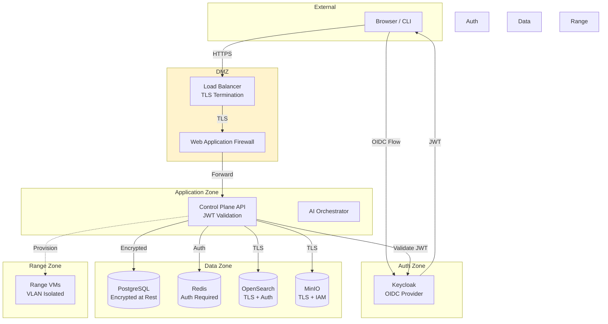
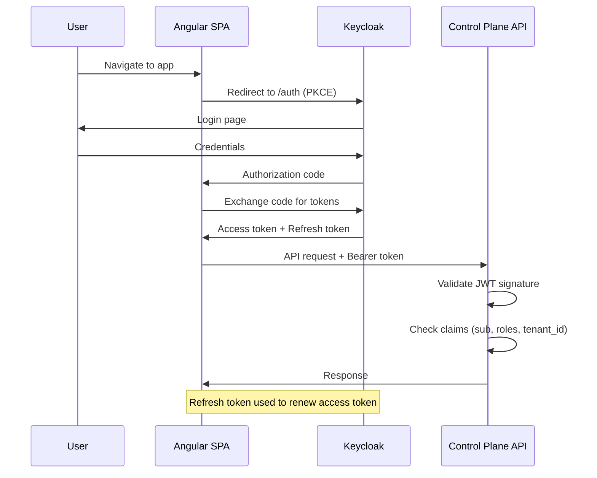
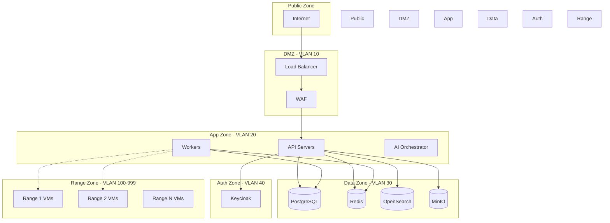

# TrueNorth Range — Security Guide

> Authentication, authorization, network security, encryption, audit logging, vulnerability management, and compliance mapping for TrueNorth Range deployments.

---

## Table of Contents

- [Security Architecture Overview](#security-architecture-overview)
- [Authentication: Keycloak OIDC](#authentication-keycloak-oidc)
- [Authorization: RBAC Model](#authorization-rbac-model)
- [Permissions Matrix](#permissions-matrix)
- [Network Security](#network-security)
- [Encryption](#encryption)
- [Rate Limiting and Input Validation](#rate-limiting-and-input-validation)
- [Audit Logging](#audit-logging)
- [Vulnerability Management](#vulnerability-management)
- [Security Hardening Checklist](#security-hardening-checklist)
- [Compliance Mapping](#compliance-mapping)

---

## Security Architecture Overview



### Security Principles

1. **Defense in Depth** — Multiple security layers from network to application
2. **Least Privilege** — Each component and user gets minimum required permissions
3. **Zero Trust** — Every request is authenticated and authorized, no implicit trust
4. **Encryption Everywhere** — TLS in transit, AES-256 at rest
5. **Audit Everything** — Every state change and admin action is logged
6. **Tenant Isolation** — Strict data separation between tenants

---

## Authentication: Keycloak OIDC

### Architecture

TrueNorth Range uses Keycloak 24 as the OpenID Connect (OIDC) identity provider. All authentication flows go through Keycloak — the API never handles passwords directly.



### JWT Token Structure

```json
{
  "iss": "https://auth.truenorth.local/realms/truenorth",
  "sub": "a1b2c3d4-e5f6-7890-abcd-ef1234567890",
  "aud": "truenorth-api",
  "exp": 1705312800,
  "iat": 1705309200,
  "realm_access": {
    "roles": ["instructor"]
  },
  "resource_access": {
    "truenorth-api": {
      "roles": ["instructor"]
    }
  },
  "tenant_id": "550e8400-e29b-41d4-a716-446655440000",
  "preferred_username": "john.doe",
  "email": "john.doe@example.com",
  "name": "John Doe"
}
```

### Keycloak Realm Configuration

```json
{
  "realm": "truenorth",
  "enabled": true,
  "sslRequired": "all",
  "bruteForceProtected": true,
  "permanentLockout": false,
  "maxFailureWaitSeconds": 900,
  "minimumQuickLoginWaitSeconds": 60,
  "waitIncrementSeconds": 60,
  "maxDeltaTimeSeconds": 43200,
  "failureFactor": 5,
  "passwordPolicy": "length(12) and digits(1) and upperCase(1) and lowerCase(1) and specialChars(1) and notUsername and passwordHistory(5)",
  "accessTokenLifespan": 3600,
  "refreshTokenMaxReuse": 0,
  "ssoSessionIdleTimeout": 1800,
  "clients": [
    {
      "clientId": "truenorth-api",
      "protocol": "openid-connect",
      "publicClient": false,
      "standardFlowEnabled": true,
      "directAccessGrantsEnabled": false,
      "serviceAccountsEnabled": true
    },
    {
      "clientId": "truenorth-spa",
      "protocol": "openid-connect",
      "publicClient": true,
      "standardFlowEnabled": true,
      "pkceCodeChallengeMethod": "S256"
    }
  ]
}
```

### API JWT Validation

The Control Plane API validates every incoming JWT:

1. **Signature verification** — RS256 using Keycloak's JWKS endpoint
2. **Issuer check** — Must match configured Keycloak realm URL
3. **Audience check** — Must include `truenorth-api`
4. **Expiration check** — Token must not be expired
5. **Role extraction** — Roles mapped from `realm_access.roles`
6. **Tenant extraction** — `tenant_id` claim for multi-tenant isolation

```python
# Simplified JWT validation flow (see control-plane/api/app/rbac.py)
async def get_current_user(token: str = Depends(oauth2_scheme)):
    payload = jwt.decode(
        token,
        key=jwks_client.get_signing_key(token).key,
        algorithms=["RS256"],
        audience="truenorth-api",
        issuer=settings.KEYCLOAK_ISSUER,
    )
    user = await get_user_by_sub(payload["sub"])
    if not user:
        raise HTTPException(401, "User not found")
    return user
```

---

## Authorization: RBAC Model

TrueNorth Range implements fine-grained Role-Based Access Control defined in `control-plane/api/app/rbac.py`.

### Roles

| Role | Description | Typical User |
|------|-------------|-------------|
| `admin` | Full platform administration | Platform administrators |
| `instructor` | Create/manage ranges, exercises, scenarios | Training instructors |
| `student` | Participate in exercises, view own data | Trainees |
| `observer` | Read-only access to ranges and exercises | Evaluators, auditors |
| `range_ops` | Infrastructure operations, provisioning | DevOps / range operators |

### Permission Categories

Permissions follow the pattern `resource:action`:

| Category | Permissions |
|----------|------------|
| **Range** | `range:create`, `range:read`, `range:update`, `range:delete`, `range:provision`, `range:destroy`, `range:batch_provision` |
| **Template** | `template:create`, `template:read`, `template:update`, `template:delete` |
| **Scenario** | `scenario:create`, `scenario:read`, `scenario:update`, `scenario:delete` |
| **Exercise** | `exercise:create`, `exercise:read`, `exercise:update`, `exercise:delete`, `exercise:control` |
| **User** | `user:create`, `user:read`, `user:update`, `user:delete` |
| **Tenant** | `tenant:create`, `tenant:read`, `tenant:update`, `tenant:delete` |
| **Audit** | `audit:read` |
| **Telemetry** | `telemetry:read` |
| **Stats** | `stats:read` |
| **AAR** | `aar:generate`, `aar:read` |

---

## Permissions Matrix

Complete role-to-permission mapping as defined in `rbac.py`:

| Permission | admin | instructor | student | observer | range_ops |
|------------|:-----:|:----------:|:-------:|:--------:|:---------:|
| `range:create` | X | X | | | X |
| `range:read` | X | X | X | X | X |
| `range:update` | X | X | | | X |
| `range:delete` | X | X | | | X |
| `range:provision` | X | X | | | X |
| `range:destroy` | X | X | | | X |
| `range:batch_provision` | X | | | | X |
| `template:create` | X | X | | | |
| `template:read` | X | X | X | X | X |
| `template:update` | X | X | | | |
| `template:delete` | X | X | | | |
| `scenario:create` | X | X | | | |
| `scenario:read` | X | X | X | X | |
| `scenario:update` | X | X | | | |
| `scenario:delete` | X | X | | | |
| `exercise:create` | X | X | | | |
| `exercise:read` | X | X | X | X | |
| `exercise:update` | X | X | | | |
| `exercise:delete` | X | X | | | |
| `exercise:control` | X | X | | | |
| `user:create` | X | | | | |
| `user:read` | X | X | | | |
| `user:update` | X | | | | |
| `user:delete` | X | | | | |
| `tenant:create` | X | | | | |
| `tenant:read` | X | | | | |
| `tenant:update` | X | | | | |
| `tenant:delete` | X | | | | |
| `audit:read` | X | | | | |
| `telemetry:read` | X | X | X | X | |
| `stats:read` | X | X | | X | X |
| `aar:generate` | X | X | | | |
| `aar:read` | X | X | X | X | |

### Permission Enforcement

Permissions are enforced at the API endpoint level using FastAPI dependency injection:

```python
# Single permission required
@router.post("/ranges", dependencies=[Depends(require_permission(Permission.RANGE_CREATE))])
async def create_range(...):
    ...

# Any of multiple permissions
@router.get("/stats", dependencies=[Depends(require_any_permission(
    Permission.STATS_READ, Permission.RANGE_READ
))])
async def get_stats(...):
    ...

# Tenant-scoped access
@router.get("/ranges/{range_id}")
async def get_range(
    range_id: UUID,
    tenant_check=Depends(require_tenant_access),
    perm_check=Depends(require_permission(Permission.RANGE_READ)),
):
    ...

# Range-specific access
@router.post("/ranges/{range_id}/provision")
async def provision_range(
    range_id: UUID,
    access=Depends(require_range_access),
    perm=Depends(require_permission(Permission.RANGE_PROVISION)),
):
    ...
```

---

## Network Security

### Network Architecture



### VLAN Isolation

| VLAN | Name | Purpose |
|------|------|---------|
| 10 | DMZ | Load balancers, WAF |
| 20 | Application | API servers, workers, AI |
| 30 | Data | PostgreSQL, Redis, OpenSearch, MinIO |
| 40 | Authentication | Keycloak |
| 100-999 | Range VLANs | Individual range environments (isolated per range) |

### Firewall Rules

```
# DMZ -> Application
ALLOW VLAN10 -> VLAN20:8080 (HTTPS to API)
ALLOW VLAN10 -> VLAN20:443  (WebSocket)

# Application -> Data
ALLOW VLAN20 -> VLAN30:5432 (PostgreSQL)
ALLOW VLAN20 -> VLAN30:6379 (Redis)
ALLOW VLAN20 -> VLAN30:9200 (OpenSearch)
ALLOW VLAN20 -> VLAN30:9000 (MinIO)

# Application -> Auth
ALLOW VLAN20 -> VLAN40:8443 (Keycloak)

# Application -> Range (provisioning only)
ALLOW VLAN20 -> VLAN100-999:22   (SSH for provisioning)
ALLOW VLAN20 -> VLAN100-999:5985 (WinRM)

# Range Isolation
DENY  VLAN100 -> VLAN200  (Range-to-range blocked)
DENY  VLAN100 -> VLAN30   (Range-to-data blocked)
ALLOW VLAN100 -> VLAN20:9200 (Telemetry to OpenSearch only)

# Default
DENY ALL
```

### Range VLAN Isolation

Each provisioned range receives a dedicated VLAN (100-999):

- **No cross-range traffic** — Ranges cannot communicate with each other
- **No data zone access** — Ranges cannot directly access PostgreSQL, Redis, etc.
- **Telemetry egress only** — Range VMs can send telemetry to OpenSearch
- **Management ingress only** — Only provisioning workers can reach range VMs

---

## Encryption

### Encryption in Transit

| Connection | Protocol | Minimum Version |
|-----------|----------|----------------|
| Client → Load Balancer | TLS | 1.2 (prefer 1.3) |
| Load Balancer → API | TLS | 1.2 |
| API → PostgreSQL | TLS | 1.2 |
| API → Redis | TLS | 1.2 |
| API → OpenSearch | TLS | 1.2 |
| API → MinIO | TLS | 1.2 |
| API → Keycloak | TLS | 1.2 |
| Inter-node (K8s) | mTLS (Istio) | 1.3 |

### TLS Configuration

```nginx
# Recommended TLS settings (nginx)
ssl_protocols TLSv1.2 TLSv1.3;
ssl_ciphers ECDHE-ECDSA-AES128-GCM-SHA256:ECDHE-RSA-AES128-GCM-SHA256:ECDHE-ECDSA-AES256-GCM-SHA384:ECDHE-RSA-AES256-GCM-SHA384;
ssl_prefer_server_ciphers on;
ssl_session_timeout 1d;
ssl_session_cache shared:SSL:50m;
ssl_stapling on;
ssl_stapling_verify on;

# HSTS
add_header Strict-Transport-Security "max-age=63072000; includeSubDomains; preload" always;
```

### Encryption at Rest

| Data Store | Method | Key Management |
|-----------|--------|---------------|
| PostgreSQL | TDE (Transparent Data Encryption) | OS-level LUKS or cloud KMS |
| OpenSearch | Node-level encryption | OpenSearch Security plugin |
| MinIO | Server-Side Encryption (SSE-S3) | MinIO KMS or Vault |
| Redis | Not encrypted at rest (volatile) | N/A — cache only |
| Backups | AES-256-GCM | Vault or cloud KMS |

---

## Rate Limiting and Input Validation

### Rate Limiting

```python
# Rate limiting tiers
RATE_LIMITS = {
    "default":        "100/minute",
    "auth":           "10/minute",   # Login attempts
    "provision":      "5/minute",    # Range provisioning
    "batch_provision":"2/minute",    # Batch operations
    "ai_request":     "30/minute",   # AI Orchestrator calls
    "websocket":      "5/minute",    # WebSocket connection attempts
}
```

| Endpoint Category | Limit | Window | Response on Exceed |
|------------------|-------|--------|-------------------|
| General API | 100 req | 1 minute | 429 + Retry-After header |
| Authentication | 10 req | 1 minute | 429 + 60s lockout |
| Provisioning | 5 req | 1 minute | 429 |
| Batch Operations | 2 req | 1 minute | 429 |
| AI Requests | 30 req | 1 minute | 429 |
| WebSocket Connect | 5 req | 1 minute | 429 |

### Input Validation

All API inputs are validated using Pydantic v2 models:

```python
class RangeCreate(BaseModel):
    name: str = Field(..., min_length=1, max_length=255, pattern=r'^[a-zA-Z0-9\s\-_]+$')
    template_id: UUID
    description: str = Field(default="", max_length=2000)
    vm_count: int = Field(default=1, ge=1, le=100)

    model_config = ConfigDict(strict=True)
```

**Validation rules applied:**
- **String lengths** — Min/max enforced on all string fields
- **Regex patterns** — Special characters restricted where appropriate
- **UUID format** — All IDs validated as proper UUIDs
- **Enum values** — State/type fields restricted to valid enum values
- **Numeric bounds** — Min/max on all numeric fields
- **No SQL injection** — SQLAlchemy parameterized queries throughout
- **No XSS** — Output encoding in templates; Angular auto-escapes
- **YAML validation** — Scenario YAML parsed with safe_load, schema-validated

---

## Audit Logging

### What Is Audited

Every state-changing operation is recorded in the `audit_logs` table:

| Event Category | Events Logged |
|---------------|--------------|
| **Authentication** | Login success/failure, token refresh, logout |
| **Range** | Create, update, delete, provision, destroy, state changes |
| **Exercise** | Create, start, pause, complete, cancel, objective ack |
| **Template** | Create, update, delete |
| **Scenario** | Create, update, delete |
| **User** | Create, update roles, delete, password change |
| **Tenant** | Create, update, delete |
| **Admin** | Configuration changes, bulk operations |

### Audit Log Schema

```sql
CREATE TABLE audit_logs (
    id          UUID PRIMARY KEY DEFAULT gen_random_uuid(),
    tenant_id   UUID NOT NULL REFERENCES tenants(id),
    user_id     UUID REFERENCES users(id),
    action      VARCHAR(100) NOT NULL,
    resource    VARCHAR(100) NOT NULL,
    resource_id UUID,
    details     JSONB,
    ip_address  INET,
    user_agent  TEXT,
    created_at  TIMESTAMP WITH TIME ZONE DEFAULT now()
);

CREATE INDEX idx_audit_tenant_created ON audit_logs(tenant_id, created_at DESC);
CREATE INDEX idx_audit_user ON audit_logs(user_id);
CREATE INDEX idx_audit_resource ON audit_logs(resource, resource_id);
```

### Querying Audit Logs

```bash
# Via API (admin only - requires audit:read permission)
curl -H "Authorization: Bearer $TOKEN" \
  "https://api.truenorth.local/admin/audit-log?limit=50&offset=0"

# Via SQL (for compliance exports)
SELECT action, resource, resource_id, details, created_at
FROM audit_logs
WHERE tenant_id = '<tenant-id>'
  AND created_at >= '2026-01-01'
  AND created_at < '2026-02-01'
ORDER BY created_at DESC;
```

### Audit Log Retention

- **Hot storage (PostgreSQL):** 90 days
- **Warm storage (export to S3/MinIO):** 365 days
- **Cold storage (archive):** 7 years (compliance)
- **Automated export:** Daily cron exports previous day's logs to MinIO

---

## Vulnerability Management

### Container Scanning

```bash
# Scan container images with Trivy
trivy image truenorth/control-plane-api:latest
trivy image truenorth/celery-worker:latest
trivy image truenorth/ai-orchestrator:latest
trivy image truenorth/scenario-engine:latest

# Scan in CI/CD pipeline (fail on HIGH/CRITICAL)
trivy image --exit-code 1 --severity HIGH,CRITICAL truenorth/control-plane-api:latest
```

### Dependency Scanning

```bash
# Python dependencies
pip-audit --requirement requirements.txt

# Node.js dependencies (frontend)
npm audit --production

# Go dependencies (if applicable)
govulncheck ./...
```

### Patch Management

| Component | Update Frequency | Method |
|-----------|-----------------|--------|
| OS packages (containers) | Weekly | Rebuild base images |
| Python packages | Monthly (critical: immediate) | pip-compile + CI |
| Node.js packages | Monthly (critical: immediate) | npm update + CI |
| Keycloak | Quarterly | Helm upgrade |
| PostgreSQL | Quarterly | Rolling restart |
| OpenSearch | Quarterly | Rolling restart |

### Penetration Testing

- **Frequency:** Annual (external) + quarterly (internal)
- **Scope:** Full platform including range VMs
- **Focus areas:** Authentication bypass, privilege escalation, tenant isolation, injection attacks

---

## Security Hardening Checklist

### API Server

- [ ] TLS 1.2+ enforced on all endpoints
- [ ] CORS configured with specific allowed origins (not `*`)
- [ ] Security headers set (HSTS, X-Content-Type-Options, X-Frame-Options, CSP)
- [ ] Rate limiting enabled on all endpoints
- [ ] Request size limits enforced (default: 10 MB)
- [ ] JWT validation with signature verification
- [ ] All inputs validated via Pydantic models
- [ ] SQLAlchemy parameterized queries (no string formatting)
- [ ] Error messages do not leak internal details
- [ ] Debug mode disabled in production
- [ ] Health endpoints do not expose sensitive info

### Database

- [ ] Strong passwords (32+ chars, generated)
- [ ] TLS required for all connections
- [ ] Connection limited to application subnet only
- [ ] Regular VACUUM and REINDEX
- [ ] Backup encryption enabled
- [ ] pg_stat_statements enabled for query auditing
- [ ] Row-level security considered for multi-tenant tables

### Redis

- [ ] Authentication required (`requirepass`)
- [ ] TLS enabled
- [ ] Bind to internal interface only
- [ ] `CONFIG` command renamed/disabled
- [ ] Memory limit set with eviction policy
- [ ] No persistent storage of secrets

### OpenSearch

- [ ] Security plugin enabled
- [ ] TLS for transport and REST layers
- [ ] Role-based access for indices
- [ ] Audit logging enabled
- [ ] Index-per-range for tenant isolation

### MinIO

- [ ] TLS enabled
- [ ] IAM policies per tenant
- [ ] Bucket versioning enabled
- [ ] Server-side encryption enabled
- [ ] Access logging enabled

### Keycloak

- [ ] Admin console restricted to internal network
- [ ] Brute force protection enabled
- [ ] Password policy configured (see above)
- [ ] Session timeouts configured
- [ ] PKCE required for SPA client
- [ ] Token lifetimes minimized (1 hour access, 24 hour refresh)
- [ ] Unused realms and clients removed

### Infrastructure

- [ ] All nodes updated with latest security patches
- [ ] SSH key-based auth only (no password)
- [ ] Kubernetes RBAC configured (least privilege)
- [ ] Network policies enforced
- [ ] Pod security standards enforced
- [ ] Secrets stored in Vault or K8s secrets (encrypted)
- [ ] Container images from trusted registries only
- [ ] No containers running as root

---

## Compliance Mapping

### NIST 800-53 Controls

| Control Family | Control | TrueNorth Implementation |
|---------------|---------|------------------------|
| **AC - Access Control** | AC-2 Account Management | Keycloak user lifecycle, admin CRUD API |
| | AC-3 Access Enforcement | RBAC with 25+ permissions, dependency injection |
| | AC-6 Least Privilege | 5 roles with granular permissions |
| | AC-7 Unsuccessful Logon Attempts | Keycloak brute force protection (5 failures) |
| | AC-8 System Use Notification | Login banner via Keycloak theme |
| | AC-12 Session Termination | JWT expiry (1h), session timeout (30min) |
| **AU - Audit** | AU-2 Event Logging | Comprehensive audit_logs table |
| | AU-3 Content of Audit Records | User, action, resource, details, IP, timestamp |
| | AU-6 Audit Review | Grafana dashboards, admin API |
| | AU-9 Protection of Audit Info | Append-only table, backup to MinIO |
| | AU-11 Audit Record Retention | 90d hot, 365d warm, 7yr cold |
| **CA - Assessment** | CA-7 Continuous Monitoring | Prometheus + Grafana + Alertmanager |
| | CA-8 Penetration Testing | Annual external, quarterly internal |
| **CM - Configuration** | CM-2 Baseline Configuration | Terraform + Packer + Helm charts |
| | CM-6 Configuration Settings | Hardening checklist above |
| **IA - Identification** | IA-2 User Identification | Keycloak OIDC with MFA support |
| | IA-5 Authenticator Management | Keycloak password policy |
| **IR - Incident Response** | IR-4 Incident Handling | Runbooks in operations guide |
| | IR-5 Incident Monitoring | Alert response procedures |
| **SC - System & Comms** | SC-8 Transmission Confidentiality | TLS 1.2+ on all connections |
| | SC-12 Cryptographic Key Management | Vault / KMS integration |
| | SC-13 Cryptographic Protection | AES-256-GCM, RSA-2048+ |
| | SC-28 Protection of Info at Rest | TDE, SSE, LUKS |
| **SI - System & Info Integrity** | SI-2 Flaw Remediation | Trivy scanning, pip-audit, npm audit |
| | SI-4 Information System Monitoring | Full observability stack |
| | SI-10 Information Input Validation | Pydantic v2 strict validation |

### FedRAMP Alignment

For FedRAMP Moderate baseline:

| Area | Requirement | Status |
|------|------------|--------|
| Authentication | MFA for privileged users | Keycloak supports TOTP/WebAuthn |
| Encryption | FIPS 140-2 validated modules | Use FIPS-enabled OpenSSL builds |
| Audit | Continuous audit log export | Daily export to immutable storage |
| Monitoring | Continuous monitoring program | Prometheus + Grafana + alerts |
| Vulnerability Management | Monthly scanning | Trivy + pip-audit in CI/CD |
| Incident Response | Documented IR plan | Runbooks in operations guide |
| Data Residency | Data within authorized boundaries | Configurable deployment regions |

### SOC 2 Type II Relevance

| Trust Service Criteria | Implementation |
|----------------------|----------------|
| **Security** | RBAC, encryption, network isolation, audit logging |
| **Availability** | Multi-region optional, health checks, auto-recovery |
| **Processing Integrity** | Input validation, state machines with transition guards |
| **Confidentiality** | Tenant isolation, encryption at rest/transit, VLAN separation |
| **Privacy** | Minimal PII collection, data retention policies |